## Contents
{:.no_toc}
*  
{: toc}


We get the dataset from yelp (https://www.yelp.com/dataset/challenge). The original dataset consists of business data, user data, review data, and checkin data: all in form of json files. Business data contains location data, attributes, and categories, while user data contains friend mapping and other metadata of users. Checkin data contains number of checkins for each business. Review data contains full review text data including the user_id that wrote the review and the business_id the review is written for.


We have generated a dataset for EDA.

First we remove all business that is not a restaurant. For joined dataset we joined all business info and user info into the review table. The resulting table includes the business information and user information for each review. This is to facilitate EDA to learn some knowledge about how attributes of business (location, etc.) and attributes of the user (number of posts, etc.) affect the review. The original dataset includes several categorical variables (categories, etc.), and original dataset stores them as lists (a restaurant can have multiple categories). In order to correctly process these variables we convert them into dummies. For example, if a restaurant is both Chinese and Breakfast, then the both column Chinese nad column Breakfast is set to 1 for that row.

In order to discover meaningful features, we perform the main part of the EDA on the data after joining the business, user and review tables. Since the original data is too large to work efficiently on (and consumes too much memory), we create a random subsample of 50000 datapoints for the EDA purpose.


```python
df = pd.read_csv("dataset_50000_2")
```


We remove the trivial columns that only have one value. Then we print the head of the csv file to have a first look of the data. We notice that there are both categorical and numeric data. We split them to do further analysis.


```python
for n in df.columns:
    if len(df[n].unique())<2:
        del df[n]
```


```python
df_numeric = df._get_numeric_data()
numerics = ['int16', 'int32', 'int64', 'float16', 'float32', 'float64']
df_categorical = df.select_dtypes(exclude=numerics)
```


```python
#select the portion of data for plotting. In the final report we use the whole subsampled dataset
df_numeric_plot = df_numeric
df_categorical_plot = df_categorical
df_plot = df
```


## Distribution of the ratings
Rating is our response variable. At first we investigate its distribution.


```python
#At first we show the ditribution of ratings
stars = {'1.0':0, '2.0':0, '3.0':0, '4.0':0, '5.0':0}
for x in df_numeric_plot["stars_x"].astype(str):
    stars[x] += 1
labels = list(stars.keys())
values = list(stars.values())
positions = [1,2,3,4,5]
plt.bar(positions, values, align='center', alpha=0.5)
plt.xticks(positions, labels)
plt.title("Rating distribution")
plt.show()
```


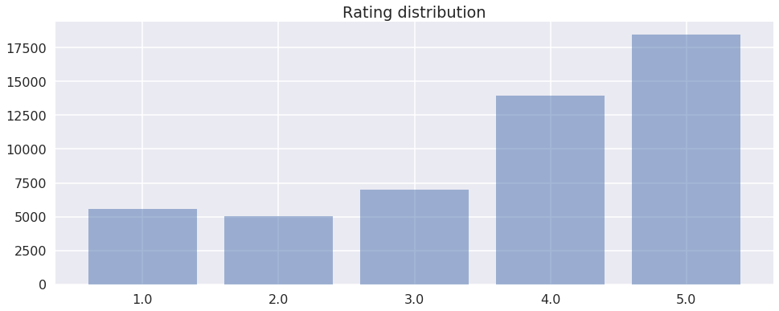


## Numeric features

We notice that, stars_restaurant, average_stars, cool_user, fans, funny_user, review_count_user, useful_user and all the features about compliments may potentially have impact on ratings. 

We show two plots below.


```python
#Use scatterplot to show the relationship between numeric features and the ratings.
##TODO: Replace the name by something without _
for n in df_numeric_plot.columns:
     if(len(df_numeric_plot[n].unique()) > 2):
        if n == "compliment_cool" or n == "compliment_hot":
            plt.title("plot for " + n)
            plt.scatter(df_numeric_plot[n], df_numeric_plot["stars_x"])        
            plt.show()
```


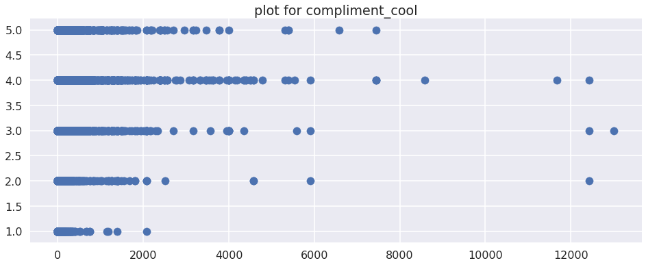


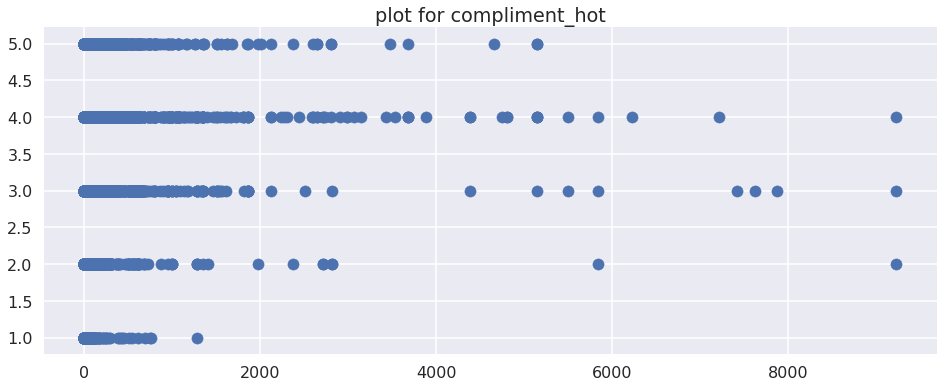


## Categorical features

For categorical features, we use boxplot to get intuition of the distribution of each category.

### City and state


```python
#Use boxplot to get the intuition of the categorical variables "city" and "state"
names = ["city", "state"]
for i in range(len(names)):
    fig, ax = plt.subplots()
    n = names[i]
    labels = list(df_categorical_plot[n].unique())
    if "01" in labels:
        labels.remove("01")
    if "3" in labels:
        labels.remove("3")
    l_count = []
    for l in labels:
        l_count += [df_numeric_plot[df_categorical_plot[n] == l]["stars_x"]]
    ax.set_title("plot for " + n)
    ax.boxplot(l_count, labels = labels, vert=False)
    fig = plt.gcf()
    fig.set_size_inches(22, 120-i*110)
    plt.show()
```


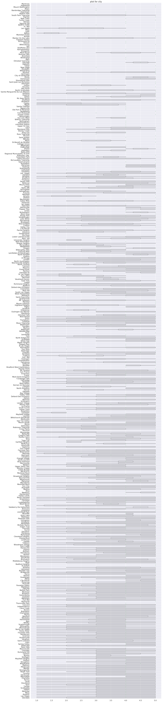


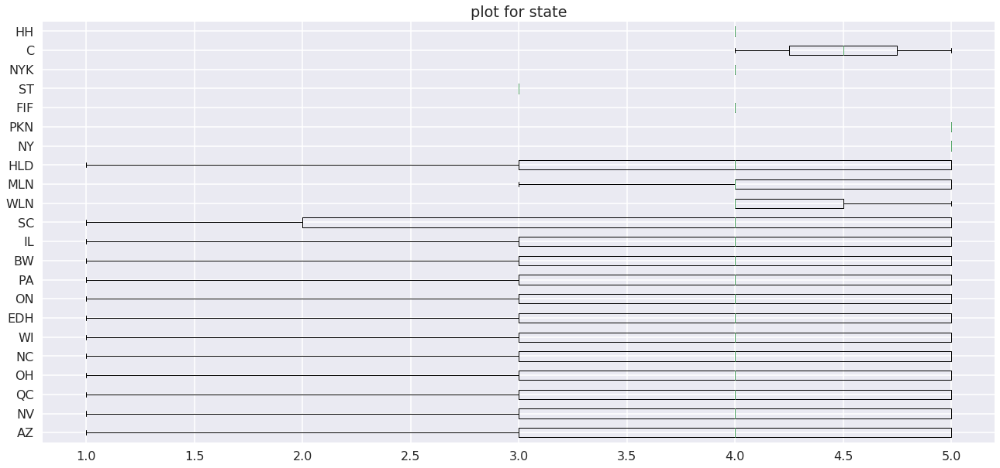


### Features from column "categories"

The column "categories" contains list of categories which the restaurants belong to. The categories can serve as features for the rating. We extract these features and do boxplot on them. 


```python
#Parse features from the column "categories" from the dataset. Use boxplots to analyse the features.
categories = defaultdict(list)
cate_list = df_plot[["categories", "stars_x"]]
for _, row in cate_list.iterrows():
        c_string, r_string = row['categories'], row['stars_x']
        c_string = c_string[1:-1]
        cs = c_string.split(",")
        for c in cs:
            categories[c].append(int(r_string))
labels = list(categories.keys())
values = list(categories.values())
fig, ax = plt.subplots()
ax.set_title("plot for categories")
ax.boxplot(values, labels = labels, vert=False)
fig = plt.gcf()
fig.set_size_inches(22, 180)
plt.show()
```


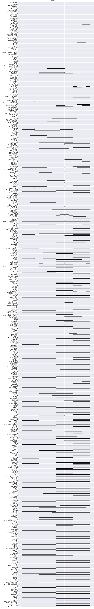


## Features from column "attributes"

The column "attributes" contains a dictionary of some attributes of the restaurant. The attributes can serve as features for the rating. We extract these features and do boxplot on them. 


```python
#Parse features from the column "attributes" from the dataset. Use boxplots to analyse the features.
attr_list = df_plot[["attributes", "stars_x"]]
dict_keys  = []

for k, value in eval(attr_list[:1]['attributes'].values[0]).items():
        if type(value) != dict:
            dict_keys.append(k)

for k in dict_keys: 
    my_dict = defaultdict(list)
    for _, row in attr_list.iterrows():
            a_dict,r  = eval(row['attributes']), int(row["stars_x"])
            try:
                key = a_dict[k]
            except:
                pass
            my_dict[key].append(r)
    labels = list(my_dict.keys())
    values = list(my_dict.values())
    fig, ax = plt.subplots()
    ax.set_title("plot for " + k)
    ax.boxplot(values, labels = labels, vert=False)
    fig = plt.gcf()
    fig.set_size_inches(22,5)
    plt.show()        
```


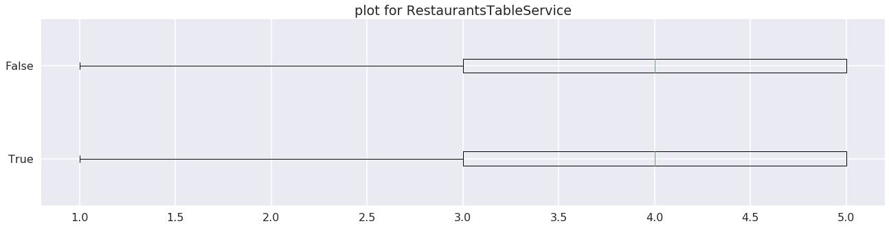


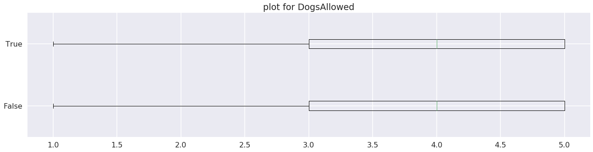


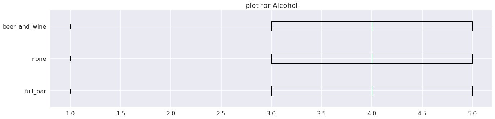


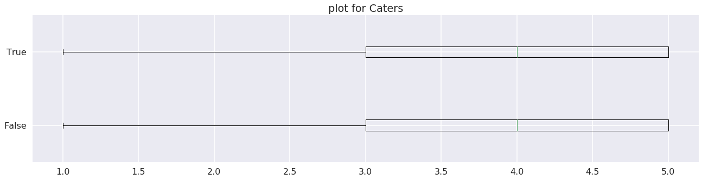


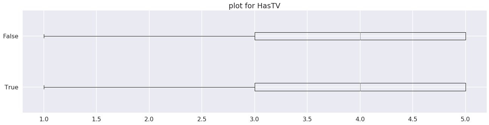


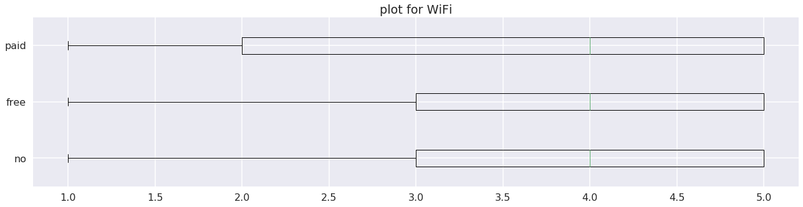


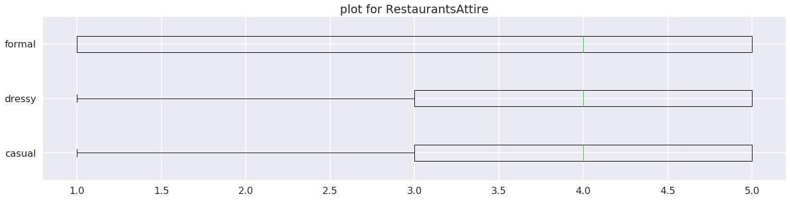


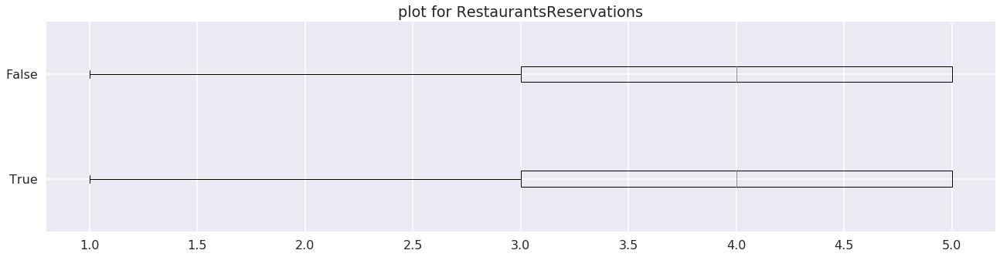


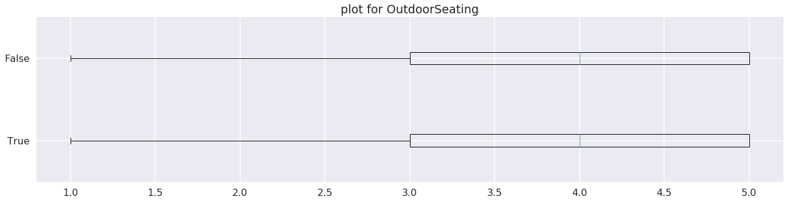


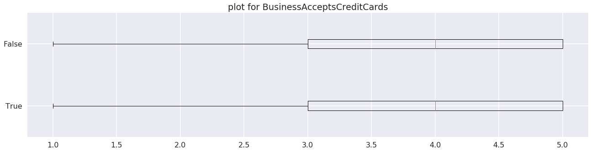


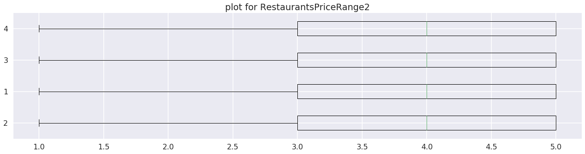


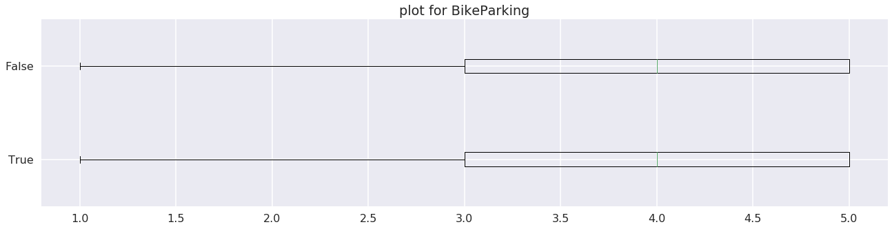


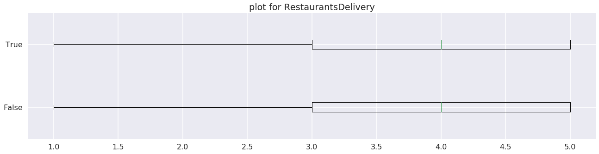


As a conclusion, many features have pretty strong correlations with the response (rating). Therefore, ensembling a content filtering based model is likely to improve the final model.
