*Group 9 - Zeyu Zhao, Hongxiang Qiu, Shiyu Huang*

**This notebook is generated by combining all notebooks and python scripts. It's what we submit to canvas as the single jupyter notebook.**

Since it's a long notebook, please refer to the following table of contents to the part of your interest! (Or you can visit our [report website](https://zeruniverse.github.io/AC209A-report/) for separate Python notebooks, which is much more clear).

# Contents
{:.no_toc}
*  
{: toc}


# EDA

We get the dataset from yelp (https://www.yelp.com/dataset/challenge). The original dataset consists of business data, user data, review data, and checkin data: all in form of json files. Business data contains location data, attributes, and categories, while user data contains friend mapping and other metadata of users. Checkin data contains number of checkins for each business. Review data contains full review text data including the user_id that wrote the review and the business_id the review is written for.

## Generated Dataset

We have generated a dataset for EDA.

First we remove all business that is not a restaurant. For joined dataset we joined all business info and user info into the review table. The resulting table includes the business information and user information for each review. This is to facilitate EDA to learn some knowledge about how attributes of business (location, etc.) and attributes of the user (number of posts, etc.) affect the review. The original dataset includes several categorical variables (categories, etc.), and original dataset stores them as lists (a restaurant can have multiple categories). In order to correctly process these variables we convert them into dummies. For example, if a restaurant is both Chinese and Breakfast, then the both column Chinese nad column Breakfast is set to 1 for that row.

In order to discover meaningful features, we perform the main part of the EDA on the data after joining the business, user and review tables. Since the original data is too large to work efficiently on (and consumes too much memory), we create a random subsample of 50000 datapoints for the EDA purpose.


```python
df = pd.read_csv("dataset_50000_2")
```


## Preliminary Data Preprocessing and data exploration

We remove the trivial columns that only have one value. Then we print the head of the csv file to have a first look of the data. We notice that there are both categorical and numeric data. We split them to do further analysis.


```python
for n in df.columns:
    if len(df[n].unique())<2:
        del df[n]
```


```python
df_numeric = df._get_numeric_data()
numerics = ['int16', 'int32', 'int64', 'float16', 'float32', 'float64']
df_categorical = df.select_dtypes(exclude=numerics)
```


```python
#select the portion of data for plotting. In the final report we use the whole subsampled dataset
df_numeric_plot = df_numeric
df_categorical_plot = df_categorical
df_plot = df
```


### Distribution of the ratings
Rating is our response variable. At first we investigate its distribution.


```python
#At first we show the ditribution of ratings
stars = {'1.0':0, '2.0':0, '3.0':0, '4.0':0, '5.0':0}
for x in df_numeric_plot["stars_x"].astype(str):
    stars[x] += 1
labels = list(stars.keys())
values = list(stars.values())
positions = [1,2,3,4,5]
plt.bar(positions, values, align='center', alpha=0.5)
plt.xticks(positions, labels)
plt.title("Rating distribution")
plt.show()
```


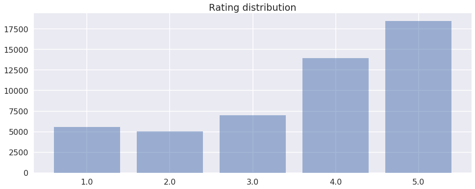


### Numeric features

We notice that, stars_restaurant, average_stars, cool_user, fans, funny_user, review_count_user, useful_user and all the features about compliments may potentially have impact on ratings. 

We show two plots below.


```python
#Use scatterplot to show the relationship between numeric features and the ratings.
##TODO: Replace the name by something without _
for n in df_numeric_plot.columns:
     if(len(df_numeric_plot[n].unique()) > 2):
        if n == "compliment_cool" or n == "compliment_hot":
            plt.title("plot for " + n)
            plt.scatter(df_numeric_plot[n], df_numeric_plot["stars_x"])        
            plt.show()
```


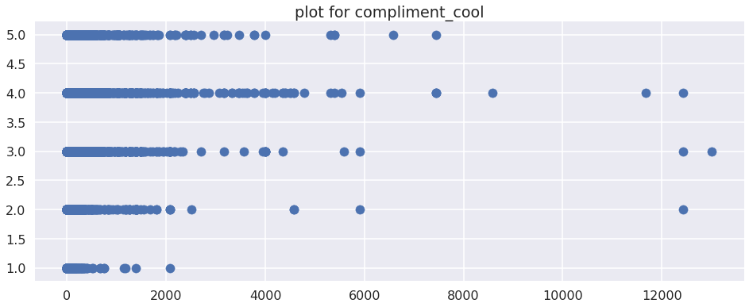


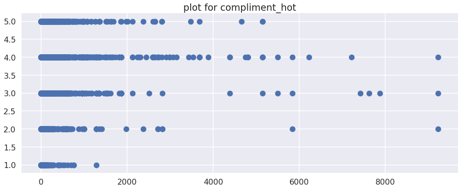


### Categorical features

For categorical features, we use boxplot to get intuition of the distribution of each category.

#### City and state


```python
#Use boxplot to get the intuition of the categorical variables "city" and "state"
names = ["city", "state"]
for i in range(len(names)):
    fig, ax = plt.subplots()
    n = names[i]
    labels = list(df_categorical_plot[n].unique())
    if "01" in labels:
        labels.remove("01")
    if "3" in labels:
        labels.remove("3")
    l_count = []
    for l in labels:
        l_count += [df_numeric_plot[df_categorical_plot[n] == l]["stars_x"]]
    ax.set_title("plot for " + n)
    ax.boxplot(l_count, labels = labels, vert=False)
    fig = plt.gcf()
    fig.set_size_inches(22, 120-i*110)
    plt.show()
```


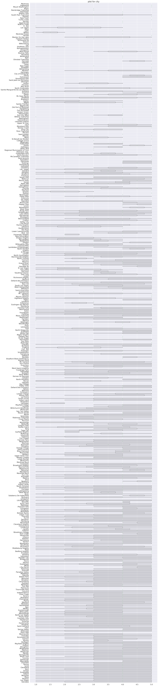


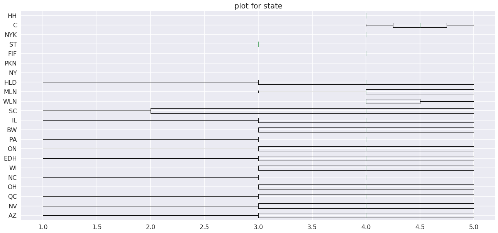


#### Features from column "categories"

The column "categories" contains list of categories which the restaurants belong to. The categories can serve as features for the rating. We extract these features and do boxplot on them. 


```python
#Parse features from the column "categories" from the dataset. Use boxplots to analyse the features.
categories = defaultdict(list)
cate_list = df_plot[["categories", "stars_x"]]
for _, row in cate_list.iterrows():
        c_string, r_string = row['categories'], row['stars_x']
        c_string = c_string[1:-1]
        cs = c_string.split(",")
        for c in cs:
            categories[c].append(int(r_string))
labels = list(categories.keys())
values = list(categories.values())
fig, ax = plt.subplots()
ax.set_title("plot for categories")
ax.boxplot(values, labels = labels, vert=False)
fig = plt.gcf()
fig.set_size_inches(22, 180)
plt.show()
```


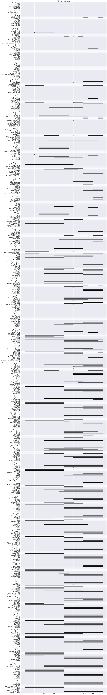


#### Features from column "attributes"

The column "attributes" contains a dictionary of some attributes of the restaurant. The attributes can serve as features for the rating. We extract these features and do boxplot on them. 


```python
#Parse features from the column "attributes" from the dataset. Use boxplots to analyse the features.
attr_list = df_plot[["attributes", "stars_x"]]
dict_keys  = []

for k, value in eval(attr_list[:1]['attributes'].values[0]).items():
        if type(value) != dict:
            dict_keys.append(k)

for k in dict_keys: 
    my_dict = defaultdict(list)
    for _, row in attr_list.iterrows():
            a_dict,r  = eval(row['attributes']), int(row["stars_x"])
            try:
                key = a_dict[k]
            except:
                pass
            my_dict[key].append(r)
    labels = list(my_dict.keys())
    values = list(my_dict.values())
    fig, ax = plt.subplots()
    ax.set_title("plot for " + k)
    ax.boxplot(values, labels = labels, vert=False)
    fig = plt.gcf()
    fig.set_size_inches(22,5)
    plt.show()        
```


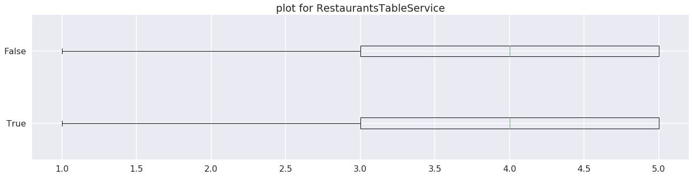


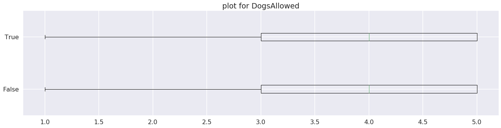


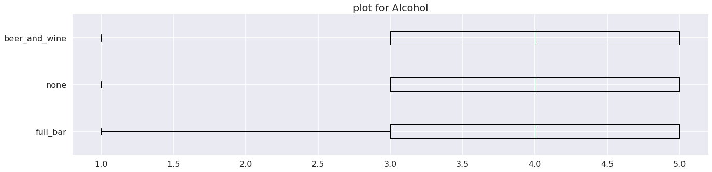


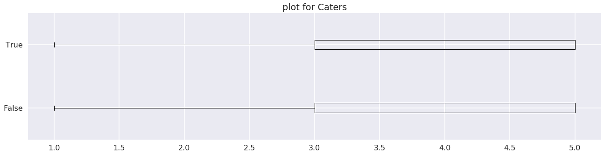


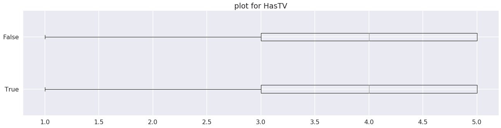


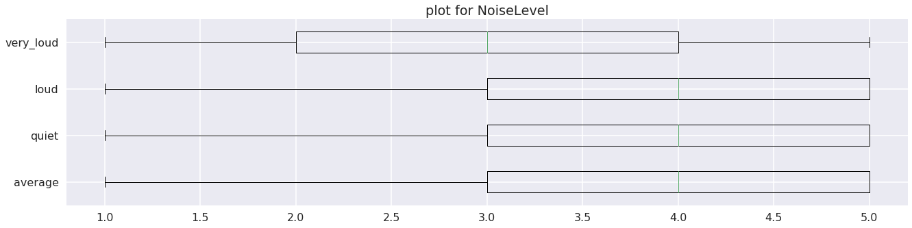


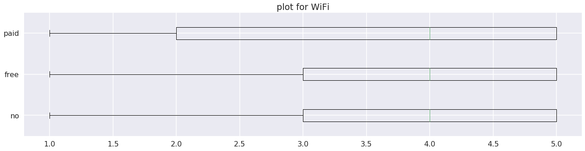


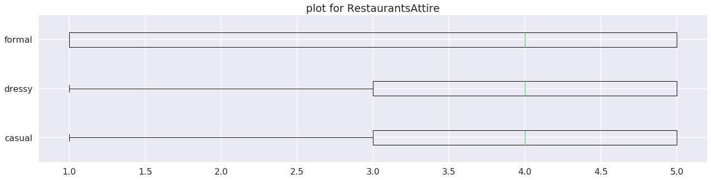


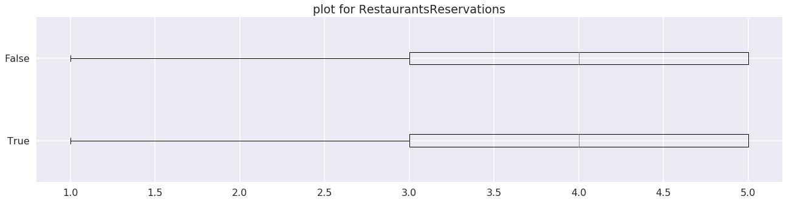


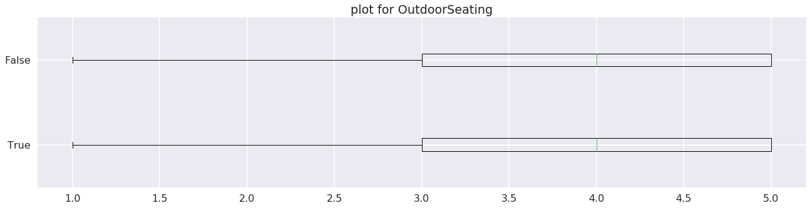


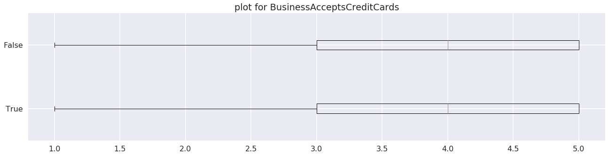


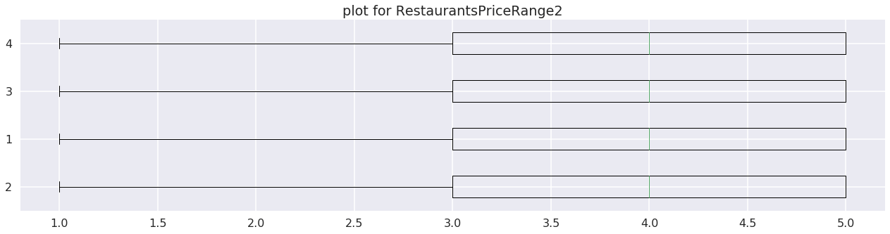


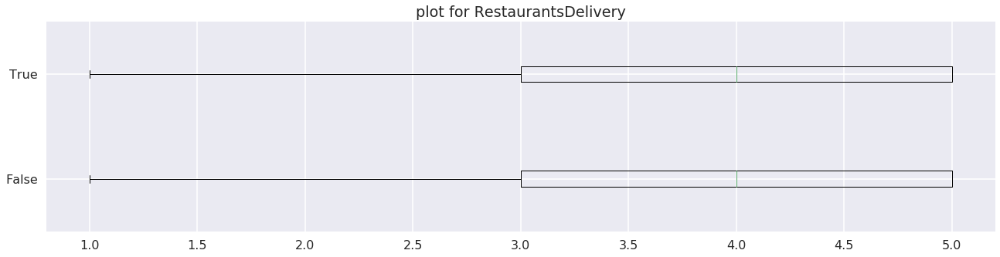


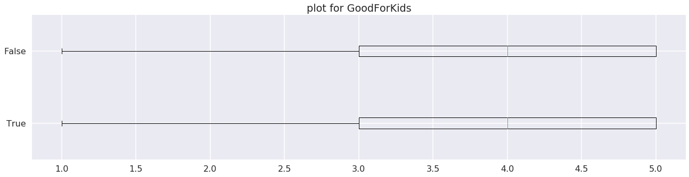


## Conclusion

As a conclusion, many features have pretty strong correlations with the response (rating). Therefore, ensembling a content filtering based model is likely to improve the final model. Due to the page limitation, we can't put all of our plots in this report.

# Data Processing

**Since the problem is sparse, we performed a stratified random sampling after joining, cleaning and filtering data.** Otherwise, most users might only appear once in the training set, in which case matrix factorization makes no sense.

We first join the three json files downloaded from Yelp. The joined dataset is saved as `data.csv`.

We reset the column name to make the meaning of each column clear.


```python
df = pd.read_csv("data.csv")
col_names = ['business_id', 
'cool_review', 
'date_review', 
'funny_review',
'review_id', 
'stars_review', 
'useful_review', 
'user_id',
'attributes_business', 
'categories_business',
'city_business',
'hours_business',
'is_open_business',
'latitude_business',
'longitude_business',
'name_business',
'neighborhood_business',
'postal_code_business',
'review_count_business',
'stars_business',
'state_business',
'average_stars_user',
'compliment_cool_user',
'compliment_cute_user',
'compliment_funny_user',
'compliment_hot_user',
'compliment_list_user',
'compliment_more_user',
'compliment_note_user',
'compliment_photos_user',
'compliment_plain_user', 
'compliment_profile_user', 
'compliment_writer_user',
'cool_user_user', 
'elite_user', 
'fans_user', 
'friends_user', 
'funny_user', 
'name_user',
'review_count_user',
'useful_user',
'yelping_since_user']
del df['Unnamed: 0']
df=df.rename(columns=dict(zip(list(df.columns), col_names)))
```


Now we subsample our data: we remove all business with less than 16 reviews, all closed business, and users with less than 6 reviews. Those data is not good for the training purpose (especially for collaborative filtering based models).


```python
df = df[df.is_open_business == 1]
df_by_business_id = df.groupby('business_id')
business_counts = df_by_business_id.count()['review_id']
threshold_business = 16
valid_business = set(business_counts.index[business_counts>=threshold_business])
b_selector = df.business_id.map(lambda b:b in valid_business)
filtered = df[b_selector]
```


```python
df_by_user_id = filtered.groupby('user_id')
user_counts = df_by_user_id.count()['review_id']
threshold_user = 6
valid_user = set(user_counts.index[user_counts>=threshold_user])
u_selector = filtered.user_id.map(lambda b:b in valid_user)
filtered = filtered[u_selector]
filtered.to_csv("filtered.csv",index=False)
```


```python
filtered_ind = df.index.isin(set(filtered.index))
filtered_out = df[~filtered_ind]
filtered_out.to_csv("filtered_out.csv",index=False) # remaining
```


Now we partition our subsample into `training`, `meta_training`, and `test` set


```python
df = pd.read_csv("filtered.csv")
```


Make sure in `training` set, each user appears 4 times (stratified random sampling)


```python
train1 = df.groupby('user_id', group_keys=False).apply(lambda x: x.sample(4))
```


```python
len(train1)
```


    331784


```python
df_ex_train1 = df[~df.index.isin(set(train1.index))]
train2 = df_ex_train1.groupby('user_id', group_keys=False).apply(lambda x: x.sample(1))
len(train2)
```


    82946


```python
df_ex_train2 = df_ex_train1[~df_ex_train1.index.isin(set(train2.index))]
len(df_ex_train2)
```


    889363


```python
train1.to_csv("subsample_1.csv", index=False) # train
train2.to_csv("subsample_2.csv", index=False) # meta_train
df_ex_train2.to_csv("subsample_3.csv", index=False) # test
```


# Predictor Selection

**We need to select some predictors for our content-filtering based models.**

To be fair, all content filtering based models will use those predictors selected in this section. The selection is conducted on the training set. Then the selected columns will be used to filter meta-training set and test set.

Unfortunately, the dataset has too many predictors to perform forward selection efficiently. As a workaround, we use recursive feature elimination (RFE) which select features by recursively considering smaller and smaller sets of features. (Since interpretation for the recommendation system is important, we don't do PCA)


```python
df_all = pd.read_csv('subsample_1.csv')
```


```python
df_all.head()
```


<div>
<style scoped>
    .dataframe tbody tr th:only-of-type {
        vertical-align: middle;
    }

    .dataframe tbody tr th {
        vertical-align: top;
    }

    .dataframe thead th {
        text-align: right;
    }
</style>
<table border="1" class="dataframe">
  <thead>
    <tr style="text-align: right;">
      <th></th>
      <th>business_id</th>
      <th>cool_review</th>
      <th>date_review</th>
      <th>funny_review</th>
      <th>review_id</th>
      <th>stars_review</th>
      <th>useful_review</th>
      <th>user_id</th>
      <th>attributes_business</th>
      <th>categories_business</th>
      <th>...</th>
      <th>compliment_writer_user</th>
      <th>cool_user_user</th>
      <th>elite_user</th>
      <th>fans_user</th>
      <th>friends_user</th>
      <th>funny_user</th>
      <th>name_user</th>
      <th>review_count_user</th>
      <th>useful_user</th>
      <th>yelping_since_user</th>
    </tr>
  </thead>
  <tbody>
    <tr>
      <th>0</th>
      <td>30546</td>
      <td>2</td>
      <td>2013-03-11</td>
      <td>0</td>
      <td>DwXbGQx5oyYc2hnbUc1hQg</td>
      <td>5</td>
      <td>2</td>
      <td>0</td>
      <td>{'Alcohol': 'beer_and_wine', 'HasTV': True, 'N...</td>
      <td>['Sandwiches', 'Food', 'American (New)', 'Amer...</td>
      <td>...</td>
      <td>9</td>
      <td>9</td>
      <td>[2013, 2010, 2011, 2012]</td>
      <td>15</td>
      <td>['yZ3Z6SIbbp9DZWxAqHHIyg', 'LbeHQ0frxP6sJew2fK...</td>
      <td>22</td>
      <td>Monera</td>
      <td>245</td>
      <td>67</td>
      <td>2007-06-04</td>
    </tr>
    <tr>
      <th>1</th>
      <td>6500</td>
      <td>0</td>
      <td>2010-11-05</td>
      <td>1</td>
      <td>nHYLl06G_Yt8dcRpzCJFiQ</td>
      <td>1</td>
      <td>1</td>
      <td>0</td>
      <td>{'GoodForMeal': {'dessert': False, 'latenight'...</td>
      <td>['French', 'Italian', 'Restaurants']</td>
      <td>...</td>
      <td>9</td>
      <td>9</td>
      <td>[2013, 2010, 2011, 2012]</td>
      <td>15</td>
      <td>['yZ3Z6SIbbp9DZWxAqHHIyg', 'LbeHQ0frxP6sJew2fK...</td>
      <td>22</td>
      <td>Monera</td>
      <td>245</td>
      <td>67</td>
      <td>2007-06-04</td>
    </tr>
    <tr>
      <th>2</th>
      <td>33528</td>
      <td>0</td>
      <td>2011-01-07</td>
      <td>4</td>
      <td>HT7owxeVvpry33QQuzzgiw</td>
      <td>1</td>
      <td>1</td>
      <td>0</td>
      <td>{'RestaurantsTableService': True, 'GoodForMeal...</td>
      <td>['Restaurants', 'Sushi Bars', 'Japanese']</td>
      <td>...</td>
      <td>9</td>
      <td>9</td>
      <td>[2013, 2010, 2011, 2012]</td>
      <td>15</td>
      <td>['yZ3Z6SIbbp9DZWxAqHHIyg', 'LbeHQ0frxP6sJew2fK...</td>
      <td>22</td>
      <td>Monera</td>
      <td>245</td>
      <td>67</td>
      <td>2007-06-04</td>
    </tr>
    <tr>
      <th>3</th>
      <td>39390</td>
      <td>0</td>
      <td>2010-10-16</td>
      <td>0</td>
      <td>1ikB-TEgwg2gigixDEDSuA</td>
      <td>4</td>
      <td>1</td>
      <td>0</td>
      <td>{'RestaurantsTableService': True, 'GoodForMeal...</td>
      <td>['Thai', 'Restaurants']</td>
      <td>...</td>
      <td>9</td>
      <td>9</td>
      <td>[2013, 2010, 2011, 2012]</td>
      <td>15</td>
      <td>['yZ3Z6SIbbp9DZWxAqHHIyg', 'LbeHQ0frxP6sJew2fK...</td>
      <td>22</td>
      <td>Monera</td>
      <td>245</td>
      <td>67</td>
      <td>2007-06-04</td>
    </tr>
    <tr>
      <th>4</th>
      <td>4506</td>
      <td>0</td>
      <td>2017-06-17</td>
      <td>0</td>
      <td>PiYJ0Fa6EVnFd3AAQOwvSw</td>
      <td>5</td>
      <td>0</td>
      <td>9</td>
      <td>{'RestaurantsTableService': True, 'GoodForMeal...</td>
      <td>['Restaurants', 'American (New)']</td>
      <td>...</td>
      <td>0</td>
      <td>0</td>
      <td>[]</td>
      <td>0</td>
      <td>['VMG0qo4X0QOLmFLJ-gkOcw', 'QQlamW29Hrg4oAJYxX...</td>
      <td>1</td>
      <td>Kristin</td>
      <td>28</td>
      <td>7</td>
      <td>2016-07-28</td>
    </tr>
  </tbody>
</table>
<p>5 rows × 42 columns</p>
</div>


```python
# response
df_all['rating'] = df_all['stars_review']

# Drop useless columns for content filtering
df_all = df_all.drop([x for x in list(df_train.columns) if x.find('_review')>-1]+
              ['review_id','user_id','business_id'],axis=1)
```


```python
# Speed up the selection, use a random sample.
_, df_sample = train_test_split(df_all, test_size=0.15, random_state=0)
df_sample=df_sample.reset_index(drop=True)
```


Select 30 features from `categories_business`


```python
df_cate = df_sample[["categories_business", "rating"]].copy()
cate_set = set()
for _, row in df_cate.iterrows():
    c_string, r_string = row['categories_business'], row['rating']
    c_string = c_string[1:-1]
    cs = c_string.split(",")
    for c in cs:
        cate_set.add(c)
        
for c in cate_set:
    #This line is the source of the warning. Any better idea to add new empty columns?
    df_cate[c]= 0
    
for i in range(df_cate.shape[0]):
    c_string, r_string = df_cate['categories_business'][i], df_cate['rating'][i]
    c_string = c_string[1:-1]
    cs = c_string.split(",")
    for c in cs:
        df_cate.at[i, c] = 1

del df_cate["categories_business"]

X_train = df_cate.iloc[:, 1:]
y_train = df_cate.iloc[:, 1]

estimator = Ridge()
#If you want automatic number, use RFECV instead
selector = RFE(estimator, 30, step=1)
selector = selector.fit(X_train, y_train)
best_features = selector.support_
```


```python
best_columns = []
for i in range(len(best_features)):
    if best_features[i]:
        best_columns.append(eval(df_cate.columns[i+1]))
print(best_columns)
```


    ['Dinner Theater', 'Buffets', 'Cafes', 'Asian Fusion', 'Vegetarian', 'Mexican', 'Mediterranean', 'French', 'Burgers', 'Breakfast & Brunch', 'Pizza', 'Fast Food', 'Bars', 'American (Traditional)', 'Japanese', 'Sandwiches', 'Steakhouses', 'Thai', 'Sushi Bars', 'Food', 'Italian', 'Seafood', 'Barbeque', 'Nightlife', 'Salad', 'Restaurants', 'American (New)', 'Chinese', 'Vietnamese', 'Coffee & Tea']


Select 30 features from `attributes_business`


```python
df_attr = df_sample[["attributes_business", "rating"]].copy()
#deal with first layer attribute
attr_list  = []
for k, value in eval(df_attr[:1]['attributes_business'].values[0]).items():
        if type(value) != dict:
            attr_list.append(k)

for a in attr_list:
    df_attr[a]= None

for i in range(df_attr.shape[0]):
        a_dict,r = eval(df_attr['attributes_business'][i]), df_attr['rating'][i]
        for a in attr_list:
            try:
                v = a_dict[a]
            except:
                pass
            df_attr.at[i, a] = v

#deal with second layer attribute
attr_list_2  = []
for key, value in eval(df_attr[:1]['attributes_business'].values[0]).items():
        if type(value) == dict:
            for k, v in value.items():
                attr_list_2.append(key+"#"+k)
for a in attr_list_2:
    df_attr[a]= None
    
for i in range(df_attr.shape[0]):
    a_dict,r = eval(df_attr['attributes_business'][i]), df_attr['rating'][i]
    for a in attr_list_2:
        k1, k2 = a.split("#")
        try:
            inner = a_dict[k1]
        except:
            pass
        try:
            v = inner[k2]
        except:
            pass
        df_attr.at[i, a] = v

del df_attr["attributes_business"]
df_attr = pd.get_dummies(df_attr, drop_first=False)

X_train = df_attr.iloc[:, 1:]
y_train = df_attr.iloc[:, 1]
estimator = Ridge()
selector = RFE(estimator, 30, step=1)
selector = selector.fit(X_train, y_train)
best_features = selector.support_
```


```python
best_columns = []
for i in range(len(best_features)):
    if best_features[i]:
        best_columns.append(df_attr.columns[i+1])
print(best_columns)
```


    ['Alcohol_False', 'Alcohol_True', 'Alcohol_2', 'Alcohol_beer_and_wine', 'Alcohol_full_bar', 'Alcohol_no', 'Alcohol_none', 'Alcohol_outdoor', 'Alcohol_yes', 'HasTV_False', 'HasTV_True', 'HasTV_2', 'HasTV_beer_and_wine', 'HasTV_full_bar', 'HasTV_none', 'HasTV_yes', 'NoiseLevel_False', 'NoiseLevel_True', 'NoiseLevel_2', 'NoiseLevel_average', 'NoiseLevel_beer_and_wine', 'NoiseLevel_full_bar', 'NoiseLevel_loud', 'NoiseLevel_none', 'NoiseLevel_quiet', 'NoiseLevel_very_loud', 'NoiseLevel_yes', 'RestaurantsAttire_False', 'RestaurantsAttire_2', 'RestaurantsAttire_yes']


Seems `Alcohol`, `NoiseLevel` and `RestaurantAttiere` are really important. Plus we know from EDA that `WiFi` is important.

Select from numerical features of the dataset:


```python
df_numeric = df_sample._get_numeric_data().copy()
numerics = ['int16', 'int32', 'int64', 'float16', 'float32', 'float64']
df_cate = df_sample.select_dtypes(exclude=numerics)
#process categorical columns
#pre-drop some non-meaningful features
df_categorical = df_cate[['city_business', 'yelping_since_user']].copy()
#engineer year feature, since date varies too much
for i in range(df_categorical.shape[0]):
    year = df_categorical.at[i, "yelping_since_user"][:4]
    df_categorical.at[i, "yelping_since_user"] = year
df_cate_final = pd.get_dummies(df_categorical, columns=['city_business', 'yelping_since_user'])

#train test split
df_final = df_cate_final.merge(df_numeric, left_index=True, right_index=True)
y_train = df_final['rating']
X_train = df_final.drop(['rating'], axis = 1)

#feature selection
estimator = Ridge()
selector = RFE(estimator, 40, step=1)
selector = selector.fit(X_train, y_train)
best_features = selector.support_ 
```


```python
best_columns = []
for i in range(len(best_features)):
    if best_features[i]:
        best_columns.append(X_train.columns[i])
print(best_columns)
```


    ['city_business_Bolton', 'city_business_Bradford West Gwillimbury', 'city_business_Brunswick', 'city_business_Burton', 'city_business_Clairton', 'city_business_Don Mills', 'city_business_Dorval', 'city_business_Elyria', 'city_business_Frazer', 'city_business_Gerlingen', 'city_business_Houston', 'city_business_LasVegas', 'city_business_Lasalle', 'city_business_Laveen Village', 'city_business_MESA', 'city_business_Mayfield', 'city_business_McKnight', 'city_business_Mentor-on-the-Lake', 'city_business_N. Las Vegas', 'city_business_N. Olmsted', 'city_business_Oakdale', 'city_business_Olmsted Falls', 'city_business_Olmsted Township', 'city_business_Presto', 'city_business_Rantoul', 'city_business_Rexdale', 'city_business_Saint Joseph', 'city_business_Sharpsburg', 'city_business_South Park', 'city_business_St-Jerome', 'city_business_Stanley', 'city_business_Sun City West', 'city_business_University Heights', 'city_business_Upper Saint Clair', 'city_business_Valley City', 'city_business_WICKLIFFE', 'city_business_Wickliffe', 'yelping_since_user_2004', 'stars_business', 'average_stars_user']


We checked all above cities and seems all of them have only a few data points. So city may not be a good predictor. We redo this selection and remove `city`


```python
df_numeric = df_sample._get_numeric_data().copy()
numerics = ['int16', 'int32', 'int64', 'float16', 'float32', 'float64']
df_cate = df_sample.select_dtypes(exclude=numerics)
#process categorical columns
#pre-drop some non-meaningful features
df_categorical = df_cate[['yelping_since_user']].copy()
#engineer year feature, since date varies too much
for i in range(df_categorical.shape[0]):
    year = df_categorical.at[i, "yelping_since_user"][:4]
    df_categorical.at[i, "yelping_since_user"] = year
df_cate_final = pd.get_dummies(df_categorical, columns=['yelping_since_user'])

#train test split
df_final = df_cate_final.merge(df_numeric, left_index=True, right_index=True)
y_train = df_final['rating']
X_train = df_final.drop(['rating'], axis = 1)

#feature selection
estimator = Ridge()
selector = RFE(estimator, 39, step=1)
selector = selector.fit(X_train, y_train)
best_features = selector.support_ 
```


```python
best_columns = []
for i in range(len(best_features)):
    if best_features[i]:
        best_columns.append(X_train.columns[i])
print(best_columns)
```


    ['yelping_since_user_2004', 'yelping_since_user_2005', 'yelping_since_user_2006', 'yelping_since_user_2007', 'yelping_since_user_2008', 'yelping_since_user_2009', 'yelping_since_user_2010', 'yelping_since_user_2011', 'yelping_since_user_2012', 'yelping_since_user_2013', 'yelping_since_user_2014', 'yelping_since_user_2015', 'yelping_since_user_2016', 'yelping_since_user_2017', 'latitude_business', 'longitude_business', 'review_count_business', 'stars_business', 'average_stars_user', 'compliment_cool_user', 'compliment_cute_user', 'compliment_funny_user', 'compliment_hot_user', 'compliment_list_user', 'compliment_more_user', 'compliment_note_user', 'compliment_photos_user', 'compliment_plain_user', 'compliment_profile_user', 'compliment_writer_user', 'cool_user_user', 'fans_user', 'funny_user', 'review_count_user', 'useful_user']


Thus, our final predictors (for content based filtering) will be: 

'yelp_since_user' (2004-2017), 'is_open_business', 'latitude_business', 'longitude_business', 'review_count_business', 'stars_business', 'average_stars_user', 'compliment_cool_user', 'compliment_cute_user', 'compliment_funny_user', 'compliment_hot_user', 'compliment_list_user', 'compliment_more_user', 'compliment_note_user', 'compliment_photos_user', 'compliment_plain_user', 'compliment_profile_user', 'compliment_writer_user', 'cool_user_user', 'fans_user', 'funny_user', 'review_count_user', 'useful_user'

Categorical: 'Dinner Theater', 'Buffets', 'Cafes', 'Asian Fusion', 'Vegetarian', 'Mexican', 'Mediterranean', 'French', 'Burgers', 'Breakfast & Brunch', 'Pizza', 'Fast Food', 'Bars', 'American (Traditional)', 'Japanese', 'Sandwiches', 'Steakhouses', 'Thai', 'Sushi Bars', 'Food', 'Italian', 'Seafood', 'Barbeque', 'Nightlife', 'Salad', 'Restaurants', 'American (New)', 'Chinese', 'Vietnamese', 'Coffee & Tea'

Attributes: Alcohol, HasTV, NoiseLevel, RestaurantAttiere and WiFi

Next, we write a function to extract those features from a given dataframe and make new dataset with only selected predictors (and ids for collaborative filtering).We performed the feature extraction on the whole dataset. All our content-filtering based models will be trained and evaluated on the new dataset.


```python
# To select those predictors from the whole set.
def filter_features(old_df):
    s_col = ['latitude_business', 'longitude_business', 'review_count_business',
     'stars_business', 'average_stars_user', 'compliment_cool_user', 'compliment_cute_user',
     'compliment_funny_user', 'compliment_hot_user', 'compliment_list_user', 'compliment_more_user',
     'compliment_note_user', 'compliment_photos_user', 'compliment_plain_user',
     'compliment_profile_user', 'compliment_writer_user', 'cool_user_user', 'fans_user',
     'funny_user', 'review_count_user', 'useful_user']
    new_df = old_df[['stars_review','business_id','user_id']+s_col].copy()
    year_col = set()
    for i in range(2004,2018):
        new_df['yelping_since_user_'+str(i)] = 0
        year_col.add(str(i))
    
    cats = set(['Dinner Theater', 'Buffets', 'Cafes', 'Asian Fusion',
            'Vegetarian', 'Mexican', 'Mediterranean', 'French', 'Burgers',
            'Breakfast & Brunch', 'Pizza', 'Fast Food', 'Bars', 'American (Traditional)',
            'Japanese', 'Sandwiches', 'Steakhouses', 'Thai', 'Sushi Bars', 'Food', 'Italian',
            'Seafood', 'Barbeque', 'Nightlife', 'Salad', 'Restaurants', 'American (New)',
            'Chinese', 'Vietnamese', 'Coffee & Tea'])
    for x in cats:
        new_df[x] = 0
    
    #attrib
    new_df['Alcohol'] = 1
    new_df['Alcohol_full_bar'] = 0
    new_df['hasTV'] = 1
    new_df['noiseLevel_quiet'] = 0
    new_df['noiseLevel_loud'] = 0
    new_df['noiseLevel_veryloud'] = 0
    new_df['RestaurantsAttire'] = 1
    new_df['RestaurantsAttire_casual']=0
    new_df['RestaurantsAttire_dressy']=0
    new_df['RestaurantsAttire_formal']=0
    new_df['WiFi_no'] = 0
    new_df['WiFi_free'] = 0
    new_df['WiFi_paid'] = 0
    no_col = ['false','no','none']
    col_id_dict = {val:rid for rid,val in enumerate(list(new_df.columns))}
    old_id_dict = {val:rid for rid,val in enumerate(list(old_df.columns))}
    for i in range(len(new_df)):
        year = old_df.iat[i,old_id_dict['yelping_since_user']][:4]
        if year in year_col:
            new_df.iat[i,col_id_dict['yelping_since_user_'+str(year)]] = 1
        cat_b = set(eval(old_df.iat[i,old_id_dict['categories_business']]))
        for x in cat_b & cats:
            new_df.iat[i,col_id_dict[x]] = 1
        adict = eval(old_df.iat[i,old_id_dict['attributes_business']])
        if 'Alcohol' not in adict or adict['Alcohol'] == False or str(adict['Alcohol']).lower() in no_col:
            new_df.iat[i,col_id_dict['Alcohol']] = 0
        elif str(adict['Alcohol']).lower() == 'full_bar':
            new_df.iat[i,col_id_dict['Alcohol_full_bar']] = 1
        if 'HasTV' not in adict or adict['HasTV'] == False or str(adict['HasTV']).lower() in no_col:
            new_df.iat[i,col_id_dict['hasTV']] = 0
        if 'NoiseLevel' not in adict or adict['NoiseLevel'] == False or str(adict['NoiseLevel']).lower() in no_col+['quiet']:
            new_df.iat[i,col_id_dict['noiseLevel_quiet']] = 1
        elif adict['NoiseLevel'] == True or str(adict['NoiseLevel']).lower() in ['loud','yes','true']:
            new_df.iat[i,col_id_dict['noiseLevel_loud']] = 1
        elif str(adict['NoiseLevel']).lower().replace(' ','').replace('_','')=='veryloud':
            new_df.iat[i,col_id_dict['noiseLevel_veryloud']] = 1
        if 'RestaurantsAttire' not in adict or adict['RestaurantsAttire'] == False or str(adict['RestaurantsAttire']).lower() in no_col:
            new_df.iat[i,col_id_dict['RestaurantsAttire']] = 0
        elif str(adict['RestaurantsAttire']).lower() == 'casual':
            new_df.iat[i,col_id_dict['RestaurantsAttire_casual']] = 1
        elif str(adict['RestaurantsAttire']).lower() == 'dressy':
            new_df.iat[i,col_id_dict['RestaurantsAttire_dressy']] = 1
        elif str(adict['RestaurantsAttire']).lower() == 'formal':
            new_df.iat[i,col_id_dict['RestaurantsAttire_formal']] = 1
        if 'WiFi' not in adict or adict['WiFi'] == False or str(adict['WiFi']).lower() in no_col:
            new_df.iat[i,col_id_dict['WiFi_no']] = 1
        elif str(adict['WiFi']).lower() == 'free':
            new_df.iat[i,col_id_dict['WiFi_free']] = 1
        elif str(adict['WiFi']).lower() == 'paid':
            new_df.iat[i,col_id_dict['WiFi_paid']] = 1
    return new_df

old = pd.read_csv('subsample_1.csv',memory_map=True)
new.to_csv('subsample_training.csv', index=False)
old = pd.read_csv('subsample_2.csv',memory_map=True)
new.to_csv('subsample_meta_training.csv', index=False)
old = pd.read_csv('subsample_3.csv',memory_map=True)
new.to_csv('subsample_test.csv', index=False)
old = pd.read_csv('filtered_out.csv',memory_map=True)
new.to_csv('remaining.csv', index=False)
```


```python
# Load processed new dataset
df_train = pd.read_csv('subsample_training.csv')

df_test = pd.read_csv('subsample_test.csv')

X_train = df_train.drop('stars_review',axis=1)
y_train = df_train.stars_review
X_test = df_test.drop('stars_review',axis=1)
y_test = df_test.stars_review
```


```python
# What's the new predictor set looks like
X_train.head()
```


<div>
<style>
    .dataframe thead tr:only-child th {
        text-align: right;
    }

    .dataframe thead th {
        text-align: left;
    }

    .dataframe tbody tr th {
        vertical-align: top;
    }
</style>
<table border="1" class="dataframe">
  <thead>
    <tr style="text-align: right;">
      <th></th>
      <th>business_id</th>
      <th>user_id</th>
      <th>latitude_business</th>
      <th>longitude_business</th>
      <th>review_count_business</th>
      <th>stars_business</th>
      <th>average_stars_user</th>
      <th>compliment_cool_user</th>
      <th>compliment_cute_user</th>
      <th>compliment_funny_user</th>
      <th>...</th>
      <th>noiseLevel_quiet</th>
      <th>noiseLevel_loud</th>
      <th>noiseLevel_veryloud</th>
      <th>RestaurantsAttire</th>
      <th>RestaurantsAttire_casual</th>
      <th>RestaurantsAttire_dressy</th>
      <th>RestaurantsAttire_formal</th>
      <th>WiFi_no</th>
      <th>WiFi_free</th>
      <th>WiFi_paid</th>
    </tr>
  </thead>
  <tbody>
    <tr>
      <th>0</th>
      <td>29615</td>
      <td>0</td>
      <td>36.100877</td>
      <td>-115.314710</td>
      <td>87</td>
      <td>4.0</td>
      <td>3.97</td>
      <td>9</td>
      <td>1</td>
      <td>9</td>
      <td>...</td>
      <td>1</td>
      <td>0</td>
      <td>0</td>
      <td>1</td>
      <td>1</td>
      <td>0</td>
      <td>0</td>
      <td>0</td>
      <td>1</td>
      <td>0</td>
    </tr>
    <tr>
      <th>1</th>
      <td>9333</td>
      <td>0</td>
      <td>36.144514</td>
      <td>-115.277522</td>
      <td>129</td>
      <td>4.0</td>
      <td>3.97</td>
      <td>9</td>
      <td>1</td>
      <td>9</td>
      <td>...</td>
      <td>0</td>
      <td>0</td>
      <td>0</td>
      <td>1</td>
      <td>1</td>
      <td>0</td>
      <td>0</td>
      <td>1</td>
      <td>0</td>
      <td>0</td>
    </tr>
    <tr>
      <th>2</th>
      <td>44237</td>
      <td>0</td>
      <td>36.159438</td>
      <td>-115.316629</td>
      <td>571</td>
      <td>4.0</td>
      <td>3.97</td>
      <td>9</td>
      <td>1</td>
      <td>9</td>
      <td>...</td>
      <td>0</td>
      <td>0</td>
      <td>0</td>
      <td>1</td>
      <td>0</td>
      <td>1</td>
      <td>0</td>
      <td>0</td>
      <td>1</td>
      <td>0</td>
    </tr>
    <tr>
      <th>3</th>
      <td>50675</td>
      <td>0</td>
      <td>36.198061</td>
      <td>-115.282510</td>
      <td>464</td>
      <td>4.5</td>
      <td>3.97</td>
      <td>9</td>
      <td>1</td>
      <td>9</td>
      <td>...</td>
      <td>1</td>
      <td>0</td>
      <td>0</td>
      <td>1</td>
      <td>1</td>
      <td>0</td>
      <td>0</td>
      <td>1</td>
      <td>0</td>
      <td>0</td>
    </tr>
    <tr>
      <th>4</th>
      <td>36778</td>
      <td>9</td>
      <td>33.581493</td>
      <td>-111.923509</td>
      <td>85</td>
      <td>4.5</td>
      <td>4.60</td>
      <td>0</td>
      <td>0</td>
      <td>0</td>
      <td>...</td>
      <td>0</td>
      <td>0</td>
      <td>0</td>
      <td>1</td>
      <td>1</td>
      <td>0</td>
      <td>0</td>
      <td>0</td>
      <td>1</td>
      <td>0</td>
    </tr>
  </tbody>
</table>
<p>5 rows × 80 columns</p>
</div>


# Modeling
## Load Data

Since the problem is sparse, we performed a stratified random sampling after joining, cleaning and filtering data. See [Data Procession](data-processing.html) page for the details about how we process data.

Then we perform [feature selection](model-exploration.html#predictor-selection) to select important predictors so we can make our content filtering based models work.

Here, we just load our pre-processed data. The training set is used to train all base models. The meta training set is used to train the meta regressor (ensembling). The test set is used to evaluate our models and the remaining set is all data that's not suitable to train our model (either user or restaurant appears too few times). Though we'll evaluate our final model on the remaining set.


```python
df_train = pd.read_csv('subsample_training.csv')
df_meta_train = pd.read_csv('subsample_meta_training.csv')
df_test = pd.read_csv('subsample_test.csv')
df_remaining = pd.read_csv('remaining.csv')

X_train = df_train.drop('stars_review',axis=1)
y_train = df_train.stars_review.values
X_meta_train = df_meta_train.drop('stars_review',axis=1)
y_meta_train = df_meta_train.stars_review.values
X_test = df_test.drop('stars_review',axis=1)
y_test = df_test.stars_review.values
X_remaining = df_remaining.drop('stars_review',axis=1)
y_remaining = df_remaining.stars_review.values
```


## Baseline Model - Regression
### No regularization
Solving the linear regression without regularization is hard since the system is under-determined ($X^TX$ is singular). An alternative is to set parameters to means. Given a dataset, we first calculate the mean of all ratings (denoted as $\hat{\mu}$). For each user $u$, we calculate the difference of the mean of all ratings he gives out and the global mean $\hat{\mu}$ (difference denoted as $\hat{\theta_u}$). For each business $m$, we calculate the difference of the mean of all ratings the business receives and the global mean $\hat{\mu}$ (difference denoted as $\hat{\gamma_m}$). The prediction of rating for user $u$ giving business $m$ would then be $\hat{\mu}+\hat{\theta_u}+\hat{\gamma_m}$.


```python
import numpy as np
import pandas as pd
from sklearn.base import BaseEstimator
from sklearn.metrics import r2_score
from scipy.sparse import lil_matrix
from sklearn.linear_model import Ridge

class MeanRegression(BaseEstimator):
    def fit(self,X,y):
        self.mu = np.mean(y)
        df_train = pd.DataFrame({"bid":X[:,0],"uid":X[:,1],"rating":y.reshape(-1)})
        self.b_dict = (df_train.groupby("bid").mean().rating-self.mu).to_dict()
        self.u_dict = (df_train.groupby("uid").mean().rating-self.mu).to_dict()
    def predict(self,X):
        X = np.array(X,dtype=int).reshape(-1,2)
        result = []
        for row in X:
            b_bias = self.b_dict[row[0]] if row[0] in self.b_dict else 0
            u_bias = self.u_dict[row[1]] if row[1] in self.u_dict else 0
            result.append(self.mu+b_bias+u_bias)
        return np.array(result).reshape(-1)
    
    def score(self,X,y):
        return r2_score(y,self.predict(X))

    def mse(self,X,y):
        return np.mean((y-self.predict(X))**2)
```


```python
reg = MeanRegression()
reg.fit(X_train.loc[:,['business_id','user_id']].as_matrix(),y_train)
print("Training R^2:", reg.score(X_train.loc[:,['business_id','user_id']].as_matrix(),y_train))
print("Training MSE:", reg.mse(X_train.loc[:,['business_id','user_id']].as_matrix(),y_train))

print("Test R^2:",reg.score(X_test.loc[:,['business_id','user_id']].as_matrix(),y_test))
print("Test MSE:", reg.mse(X_test.loc[:,['business_id','user_id']].as_matrix(),y_test))
```


    Training R^2: 0.413268705482
    Training MSE: 0.943767605504
    Test R^2: -0.0867599375195
    Test MSE: 1.46768604971


### L2 Regularization
This is same as fitting a `ridge` regression on **dummied predictors** `business_id` and `user_id`. The challenge of this regression is solving the sparse matrix. In the complete data, the `X` (dummied predictor) matrix will have around one million columns. Since ridge regression has closed form solution ($\beta=(X^TX+\lambda I)^{-1}X^Ty$, since we don't want to regularize intercept, the top-left element of $I$ should be set to 0), We solve the system with `scipy.spsolve`. Note here we have regularization terms, the system is solvable.


```python
class SparseRidgeRegression(BaseEstimator):
    def __init__(self, alpha=0, max_iter=1500, tol=1e-5):
        self.alpha = alpha
        self.max_iter = max_iter
        self.tol = tol
        
    def fit(self,X,y):
        X = np.array(X,dtype=int).reshape(-1,2)
        y = np.array(y).reshape(-1,1)

        bids = np.unique(X[:,0])
        uids = np.unique(X[:,1])
        self.b_dict = {bid:pos for pos,bid in enumerate(bids)}
        self.u_dict = {uid:pos for pos,uid in enumerate(uids)}
        bids_len = len(bids)
        design_matrix = lil_matrix((len(X),len(bids)+len(uids)))
        for rid,row in enumerate(X):
            design_matrix[rid,self.b_dict[row[0]]] = 1
            design_matrix[rid,bids_len+self.u_dict[row[1]]] = 1
        
        design_matrix = design_matrix.tocsr()
        ridge = Ridge(alpha=self.alpha, fit_intercept=True, copy_X=False,
                      solver='sag', max_iter=self.max_iter, tol=self.tol)
        ridge.fit(design_matrix,y)
        self.mu = ridge.intercept_
        coef = ridge.coef_.reshape(-1)
        for i in range(len(bids)):
            self.b_dict[bids[i]] = coef[i]
        for i in range(len(uids)):
            self.u_dict[uids[i]] = coef[bids_len+i]
            
        return self
    
    def predict(self,X):
        X = np.array(X,dtype=int).reshape(-1,2)
        result = []
        for row in X:
            b_bias = self.b_dict[row[0]] if row[0] in self.b_dict else 0
            u_bias = self.u_dict[row[1]] if row[1] in self.u_dict else 0
            result.append(self.mu+b_bias+u_bias)
        return np.array(result).reshape(-1)
    
    def score(self,X,y):
        return r2_score(y,self.predict(X))

    def mse(self,X,y):
        return np.mean((y-self.predict(X))**2)
```


```python
l2_reg = GridSearchCV(SparseRidgeRegression(),{"alpha":[0.1,1,10]})
l2_reg.fit(X_train.loc[:,['business_id','user_id']].as_matrix(),y_train)
print("best_alpha:", l2_reg.best_params_['alpha'])
l2_reg = SparseRidgeRegression(alpha=l2_reg.best_params_['alpha'])
l2_reg.fit(X_train.loc[:,['business_id','user_id']].as_matrix(),y_train)
print("Training R^2:", l2_reg.score(X_train.loc[:,['business_id','user_id']].as_matrix(),y_train))
print("Training MSE:", l2_reg.mse(X_train.loc[:,['business_id','user_id']].as_matrix(),y_train))

print("Test R^2:", l2_reg.score(X_test.loc[:,['business_id','user_id']].as_matrix(),y_test))
print("Test MSE:", l2_reg.mse(X_test.loc[:,['business_id','user_id']].as_matrix(),y_test))
```


    best_alpha: 10
    Training R^2: 0.298990002089
    Training MSE: 1.12758690962
    Test R^2: 0.133367873022
    Test MSE: 1.17040004796


Significantly improved test $R^2$ (negative to positive).

## Matrix Factorization

We first construct the residual matrix by subtracting predicted values (from L2 reg model) from actual ratings. Then we factorize the residual matrix into P \* Q while minimizing (squared residual + alpha \* (sum of squared elements of P and Q)). i.e. $$\sum_{(u,i)}{(r_{ui}-p_u^Tq_i)^2+\alpha(\| p_u\|^2+\| q_i\|^2)}$$. And to solve it we alternating from fixing P and solve for Q and fixing Q and solve for P. (each is a solvable least square problem). To reduce running time we applied massive paralleization.


```python
# get predicted values from baseline
baseline_predicted_train = l2_reg.predict(X_train.loc[:,['business_id','user_id']].as_matrix())
baseline_predicted_test = l2_reg.predict(X_test.loc[:,['business_id','user_id']].as_matrix())
```


```python
def residual_to_matrix(X_train, residual):
    user_id_encoding = np.unique(X_train.user_id)
    business_id_encoding = np.unique(X_train.business_id)
    reverse_user_id_encoding = {k:v for v,k in enumerate(user_id_encoding)}
    reverse_business_id_encoding = {k:v for v,k in enumerate(business_id_encoding)}
    
    X_residual = scipy.sparse.dok_matrix((len(user_id_encoding),len(business_id_encoding)))
    for i in range(len(X_train)):
        r = residual[i]
        uid = int(X_train.iloc[i]['user_id'])
        bid = int(X_train.iloc[i]['business_id'])
        X_residual[reverse_user_id_encoding[uid],reverse_business_id_encoding[bid]]=r
        
    return X_residual,user_id_encoding,business_id_encoding,reverse_user_id_encoding,reverse_business_id_encoding
```


```python
# construct residual matrix
residual = np.array(y_train) - baseline_predicted_train
X_residual,user_id_encoding,business_id_encoding,reverse_user_id_encoding,reverse_business_id_encoding = residual_to_matrix(X_train, residual)
X_residual
```


    <82946x21826 sparse matrix of type '<class 'numpy.float64'>'
    	with 331784 stored elements in Dictionary Of Keys format>


```python
import concurrent.futures
from typing import Tuple, List, Optional, Any

import numpy as np
import scipy.sparse
from functools import partial
import ctypes
import multiprocessing as mp
from scipy.optimize import nnls
import numpy.linalg as la


def get_u_selector(u: int):
    u_selector = np.sort(data_bag.X_csr[u, :].indices)
    yu = np.asarray(data_bag.X_csr[u, u_selector].todense()).reshape(-1)
    #yu = np.concatenate([yu, data_bag.rhs_zeros])
    return u_selector, yu

def get_b_selector(b: int):
    b_selector = np.sort(data_bag.X_csc[:, b].indices)
    yb = np.asarray(data_bag.X_csc[b_selector, b].todense()).reshape(-1)
    #yb = np.concatenate([yb, data_bag.rhs_zeros])
    return b_selector, yb

def _nnls(a, b):
    return nnls(a, b)[0]

def _lasolve(a,b):
    return la.solve(a, b)

def _lalstsq(a, b):
    return la.lstsq(a, b)[0]

def __solve_with_reg2(a, y):
    #return _lalstsq(np.vstack([a, data_bag.reg]), y)
    #return _lalstsq(np.vstack([a, data_bag.reg]), y)
    ata = a.T.dot(a)
    lhs = ata + data_bag.reg
    rhs = y.dot(a)
    return _lasolve(lhs, rhs)

def solve_pu(u: int, QT):
    select = data_bag.u_selectors[u]
    pu = __solve_with_reg2(QT[select, :], data_bag.y_for_us[u])
    return pu

def solve_qb(b: int, P):
    select = data_bag.b_selectors[b]
    qb = __solve_with_reg2(P[select, :], data_bag.y_for_bs[b])
    return qb

def solve_pu2(u):
    QT = np.ctypeslib.as_array(data_bag.QT_mem.get_obj()).reshape(data_bag.Nb, data_bag.h)
    return solve_pu(u, QT=QT)

def solve_qb2(b):
    P = np.ctypeslib.as_array(data_bag.P_mem.get_obj()).reshape(data_bag.Nu, data_bag.h)
    return solve_qb(b, P=P)

class CfALSInitializationDataBag:
    def __init__(self, cfals=None, pickled=None):
        if cfals is None and pickled is None:
            raise ValueError
        elif cfals is not None and pickled is not None:
            raise ValueError
        elif cfals is not None:
            self.X_csc = cfals.X_csc
            self.X_csr = cfals.X_csr
            self.rhs_zeros = cfals.rhs_zeros
        else:
            self.X_csc = pickled['X_csc']
            self.X_csr = pickled['X_csr']
            self.rhs_zeros = pickled['rhs_zeros']
    
    def get_pickled(self):
        return {    'X_csc': self.X_csc,
                    'X_csr': self.X_csr,
                    'rhs_zeros': self.rhs_zeros
               }
    
    def get_initializer(self):
        def init():
            global data_pickled
            global data_bag
            data_bag = CfALSInitializationDataBag(pickled = data_pickled)
        return init
    
class CfALSDataBag:
    def __init__(self, cfals=None, pickled=None):
        self.reg = self.__get_data('reg', cfals=cfals, pickled=pickled)
        self.u_selectors = self.__get_data('u_selectors', cfals=cfals, pickled=pickled)
        self.b_selectors = self.__get_data('b_selectors', cfals=cfals, pickled=pickled)
        self.y_for_us = self.__get_data('y_for_us', cfals=cfals, pickled=pickled)
        self.y_for_bs = self.__get_data('y_for_bs', cfals=cfals, pickled=pickled)
        self.P_mem = self.__get_data('P_mem', cfals=cfals, pickled=pickled)
        self.QT_mem = self.__get_data('QT_mem', cfals=cfals, pickled=pickled)
        self.h = self.__get_data('h', cfals=cfals, pickled=pickled)
        self.Nu = self.__get_data('Nu', cfals=cfals, pickled=pickled)
        self.Nb = self.__get_data('Nb', cfals=cfals, pickled=pickled)
    
    def __get_data(self, key, cfals=None, pickled=None, pickled_processor=None):
        if cfals is None and pickled is None:
            raise ValueError
        if cfals is not None and pickled is not None:
            raise ValueError
        if cfals is not None:
            return cfals.__dict__[key]
        if pickled_processor is None:
            return pickled[key]
        return pickled_processor(pickled[key])
    
    def get_pickled(self):
        return {    'reg': self.reg,
                    'u_selectors': self.u_selectors,
                    'b_selectors': self.b_selectors,
                    'y_for_us': self.y_for_us,
                    'y_for_bs': self.y_for_bs,
                    'P_mem': self.P_mem,
                    'QT_mem': self.QT_mem,
                    'h': self.h,
                    'Nu': self.Nu,
                    'Nb': self.Nb,
               }
    
    def get_initializer(self):
        def init():
            global data_pickled
            global data_bag
            data_bag = CfALSDataBag(pickled = data_pickled)
        return init

class CFALSInitializationExecutor:
    def __init__(self, n_workers:int):
        self.data_bag = None
        self.n_workers = n_workers
    
    def initialize(self, cfals):
        self.data_bag = CfALSInitializationDataBag(cfals)
        
        global data_pickled
        data_pickled = self.data_bag.get_pickled()
        
        init = self.data_bag.get_initializer()
        self.pool = mp.Pool(processes=self.n_workers,initializer=init)
    
    def execute(self, func, parameters):
        return self.pool.map(func, parameters)
        
    def close(self):
        self.pool.close()

        
class CFALSExecutor:
    def __init__(self, n_workers:int):
        self.data_bag = None
        self.n_workers = n_workers
    
    def initialize(self, cfals):
        self.data_bag = CfALSDataBag(cfals)
        
        global data_pickled
        data_pickled = self.data_bag.get_pickled()
        
        init = self.data_bag.get_initializer()
        self.pool = mp.Pool(processes=self.n_workers,initializer=init)
    
    def execute(self, func, parameters):
        return self.pool.map(func, parameters)
    
        
    def close(self):
        self.pool.close()
        
def _random(*size):
    # all numbers are initialized between 0 and 1, is it a problem?
    return np.random.randn(*size)

def _point_wise_norm_square(x: np.ndarray):
    return np.sum(np.abs(x) ** 2)

class CfALS:
    def __init__(self, x: scipy.sparse.spmatrix, h: int, alpha: float, num_workers = None):
        """
        Arguments
        ==========
        x: scipy.sparse.coo_matrix
            user*restaurant rating residual.
        h: int
            number of hidden variables
        alpha: float
            regularization constant, should be same as the coefficient as previous regressions
        """
        self.X_dok = x.todok()  # type: scipy.sparse.dok_matrix
        self.X_csr = x.tocsr()  # type: scipy.sparse.csr_matrix
        self.X_csc = x.tocsc()  # type: scipy.sparse.csc_matrix
        self.h = h
        self.alpha = alpha
        self.Nu, self.Nb = self.X_dok.shape  # type: Tuple[int,int]
        self.P = None  # type: np.ndarray
        self.QT = None  # type: np.ndarray
        self.reg = np.eye(h) * alpha  # type: np.ndarray
        self.rhs_zeros = np.zeros(h)

        self.Us = list(range(self.Nu))
        self.Bs = list(range(self.Nb))

        self.u_selectors = [None] * self.Nu  # type: List[np.ndarray]
        self.b_selectors = [None] * self.Nb  # type: List[np.ndarray]
        self.y_for_us = [None] * self.Nu  # type: List[np.ndarray]
        self.y_for_bs = [None] * self.Nb  # type: List[np.ndarray]
        
        ie = alsmp.CFALSInitializationExecutor(num_workers)
        try:
            ie.initialize(cfals=self)
            for u,r in enumerate(ie.execute(alsmp.get_u_selector, self.Us)):
                self.u_selectors[u] = r[0]
                self.y_for_us[u] = r[1]
                
            for b,r in enumerate(ie.execute(alsmp.get_b_selector, self.Bs)):
                self.b_selectors[b] = r[0]
                self.y_for_bs[b] = r[1]
        except:
            raise
        finally:
            ie.close()
        
        self.prev_loss = None  # type: Optional[float]
        self.cur_loss = None  # type: Optional[float]
        
        self.P_mem = mp.Array(ctypes.c_double, self.Nu*self.h)
        self.QT_mem = mp.Array(ctypes.c_double, self.Nb*self.h)
        self.P = np.ctypeslib.as_array(self.P_mem.get_obj()).reshape(self.Nu, self.h)
        self.QT = np.ctypeslib.as_array(self.QT_mem.get_obj()).reshape(self.Nb, self.h)

        
    def initialize(self):
        self.P[:] = _random(self.Nu, self.h)
        self.QT[:] = _random(self.Nb, self.h)

        self.prev_loss = self.cur_loss
        self.cur_loss = None

    def steps(self, n, executor: alsmp.CFALSExecutor):
        for i in range(n):
            self.step(executor=executor)

    def step(self, executor: alsmp.CFALSExecutor):
        self.prev_loss = self.cur_loss

        #for u,pu in enumerate(executor.execute(partial(alsmp.solve_pu, QT=self.QT), self.Us)):
        for u,pu in enumerate(executor.execute(alsmp.solve_pu2, self.Us)):
            self.P[u,:] = pu

        #for b,qb in enumerate(executor.execute(partial(alsmp.solve_qb, P=self.P), self.Bs)):
        for b,qb in enumerate(executor.execute(alsmp.solve_qb2, self.Bs)):
            self.QT[b,:] = qb

        self.cur_loss = self.loss()

        if self.prev_loss is not None and self.cur_loss > self.prev_loss:
            print("Loss increased")

    def factorize(self,
                  max_iterations: int = 10000,
                  eps: float = 0.001,
                  skip_initialize: bool = False,
                  executor: alsmp.CFALSExecutor = None):
        if executor is None:
            raise ValueError("An instance of Executor must be passed in")
        if not skip_initialize:
            self.initialize()
        i = 0
        while i < max_iterations and (
                        (self.cur_loss is None) or (self.prev_loss is None) or (
                            abs(self.cur_loss - self.prev_loss) > eps)):
            self.step(executor=executor)
            i += 1
        if abs(self.cur_loss - self.prev_loss) >= eps:
            print("Did not converge!")
        return self.P, self.QT.T

    def loss(self):
        reg = self.alpha * (_point_wise_norm_square(self.P) + _point_wise_norm_square(self.QT))
        return self.loss_no_reg() + reg

    def loss_no_reg(self):
        result = 0.0
        for (u, b) in self.X_dok.keys():
            result += (self.get_r(u, b) - self.X_dok[u, b]) ** 2
        return result

    def get_r(self, u: int, b: int) -> float:
        return self.P[u, :].dot(self.QT[b, :])
```


```python
# Do matrix factorization
from src.cfals import CfALS
from src.cfals_mp import CFALSExecutor

h = 15 # number of latent variables
alpha = 25 # regularization constant
# this line will take some time, depending on the computer (~1min on mine)
# it will perform some pre-calculation to make future iterations faster 
cfals = CfALS(X_residual, h=h, alpha=alpha)
```


```python
cfals.initialize()
```


```python
executor = CFALSExecutor(n_workers=20)
executor.initialize(cfals)
```


```python
prev_loss = cfals.cur_loss
print(prev_loss)
for i in range(10):
    cfals.steps(1, executor)
    cur_loss = cfals.cur_loss
    if i < 10 or (i%10==0):
        print(cur_loss)
    if prev_loss is not None and (abs(cur_loss-prev_loss) < 1 or cur_loss > prev_loss):
        break
    prev_loss = cur_loss
```


    None
    444851.71365
    375018.926381
    374199.641155
    374127.347447
    374110.677804
    374104.585515
    374101.727605
    374100.158678
    374099.197665


```python
# close the executor if done, otherwise you might have too many file handles open
executor.close()
```


```python
def get_predicted_residuals(cfals, X):
    result = np.zeros(len(X))
    missing_values = 0 
    for i in range(len(X)):
        uid = int(X.iloc[i]['user_id'])
        bid = int(X.iloc[i]['business_id'])
        try:
            uid = reverse_user_id_encoding[uid]
            bid = reverse_business_id_encoding[bid]
        except KeyError:
            #print(uid,bid,"doesn't exist in training data")
            result[i] = 0
            missing_values += 1
            continue
        result[i] = cfals.get_r(uid, bid)
    return result, missing_values
```


```python
train_resid,_ = get_predicted_residuals(cfals, X_train)
predicted_y_train = baseline_predicted_train + train_resid

print("Training R^2:", r2_score(y_train,predicted_y_train))
print("Training MSE:", mean_squared_error(y_train,predicted_y_train))
```


    Training R^2: 0.299639269683
    Training MSE: 1.12654255128


```python
test_resid,missing_values = get_predicted_residuals(cfals, X_test)
predicted_y_test = baseline_predicted_test + test_resid

print("Test R^2:", r2_score(y_test,predicted_y_test))
print("Test MSE:", mean_squared_error(y_test,predicted_y_test))
```


    Test R^2: 0.133367983645
    Test MSE: 1.17039989857


Test $R^2$ improved slightly compared to just regression alone

## Models of Our Own Choice - Try Other Models
For models of our own choice, we've tested `item-based KNN` (collaborative filtering), `ridge regression`, `lasso regression`, `fully connected neural network`, `KNN` (content filtering) and `random forest regression` and `Linear SVR`. `fully connected neural network` and `item-based KNN` are not covered in lectures.

We choose `ridge`, `lasso` and `random forest` as our own models since they give the best performance.

### Item-based KNN

**First, construct rating matrix**


```python
def df_to_matrix(X_train, y):
    user_id_encoding = np.unique(X_train.user_id)
    business_id_encoding = np.unique(X_train.business_id)
    reverse_user_id_encoding = {k:v for v,k in enumerate(user_id_encoding)}
    reverse_business_id_encoding = {k:v for v,k in enumerate(business_id_encoding)}
    
    X_result = scipy.sparse.dok_matrix((len(user_id_encoding),len(business_id_encoding)))
    for i in range(len(X_train)):
        r = y.iloc[i]
        uid = int(X_train.iloc[i]['user_id'])
        bid = int(X_train.iloc[i]['business_id'])
        X_result[reverse_user_id_encoding[uid],reverse_business_id_encoding[bid]]=r
        
    return X_result,user_id_encoding,business_id_encoding,reverse_user_id_encoding,reverse_business_id_encoding

X_train_matrix,user_id_encoding,business_id_encoding,reverse_user_id_encoding,\
reverse_business_id_encoding = df_to_matrix(X_train, y_train)
```


**Then construct similarity matrix**


```python
M = X_train_matrix.shape[1]
item_users = [set() for _ in range(M)]
for (i,j) in X_train_matrix.keys():
    item_users[j].add(i)
no_joint = 0
for i in range(M):
    for j in range(i+1, M):
        u1 = item_users[i]
        u2 = item_users[j]
        joint = u1 & u2
        # we are supposed to calculate similarity here, but we encountered some issues...
        # more to follow
        if len(joint) == 0:
            no_joint += 1
```


```python
print(no_joint/(M*(M-1)/2)*100, "% of our similairty matrix is undefined!") 
```


    99.80996927799993 % of our similairty matrix is undefined!


While constructing our similarity matrix, we observed that we have so many restaurant pairs that don't share common users. sim(a,b) will be undefined according to [1]. Therefore item-based knn won't work because of the sparsity we have in this dataset.
[1] http://cs229.stanford.edu/proj2008/Wen-RecommendationSystemBasedOnCollaborativeFiltering.pdf

From now on, we try some content filtering based models. So, we should drop `user_id` and `business_id`.


```python
X_train = X_train.drop(['user_id','business_id'],axis=1)
X_test = X_test.drop(['user_id','business_id'],axis=1)
```


### Ridge


```python
ridge = RidgeCV()
ridge.fit(X_train,y_train)
print("Ridge:")
print("Training R^2:", ridge.score(X_train,y_train))
print("Training MSE:",mean_squared_error(y_train,ridge.predict(X_train)))
print("Test R^2:", ridge.score(X_test,y_test))
print("Training MSE:",mean_squared_error(y_train,ridge.predict(X_train)))
```


    Ridge:
    Training R^2: 0.258900935955
    Training MSE: 1.1920708775
    Test R^2: 0.226618647701
    Training MSE: 1.1920708775


### Lasso


```python
lasso = LassoCV(n_jobs=-1)
lasso.fit(X_train,y_train)
print("Lasso:")
print("Training R^2:", lasso.score(X_train,y_train))
print("Training MSE:",mean_squared_error(y_train,lasso.predict(X_train)))
print("Test R^2:", lasso.score(X_test,y_test))
print("Test MSE:",mean_squared_error(y_test,lasso.predict(X_test)))
```


    Lasso:
    Training R^2: 0.242634995273
    Training MSE: 1.21823492915
    Test R^2: 0.21596654473
    Test MSE: 1.05884926844


### Fully Connected Neural Net

We made the training and the test of the neural network as a separate Python script below (we run the training in terminal not on notebook). We used a three layer fully-connected network. We used some code in the Tensorflow MNIST tutorial [2] (https://www.tensorflow.org/get_started/mnist/pros) to implement our network.


```python
# Some code from https://www.tensorflow.org/get_started/mnist/pros

# PLEASE RUN IN TERMINAL -- VERY SLOW

import numpy as np
import pandas as pd

train_df = pd.read_csv('subsample_training.csv')
X_train = train_df.drop(['business_id','user_id'],axis=1).as_matrix()
test_df = pd.read_csv('subsample_test.csv')
X_test = test_df.drop(['business_id','user_id'],axis=1).as_matrix()

import tensorflow as tf

def weight_variable(shape):
    initial = tf.truncated_normal(shape, stddev=0.01)
    return tf.Variable(initial)


def bias_variable(shape):
    initial = tf.constant(0.0, shape=shape)
    return tf.Variable(initial)

input_ = tf.placeholder(tf.float32, [None, 79])
shuffled_input = tf.random_shuffle(input_)

# correct star
y_ = tf.reshape(shuffled_input[:,0], [-1,1])

# input data
x = tf.reshape(shuffled_input[:,1:], [-1,78])

# build the network
keep_prob_input = tf.placeholder(tf.float32, name='keep_prob_input')
x_drop = tf.nn.dropout(x, keep_prob=keep_prob_input)

W_fc1 = weight_variable([78, 500])
b_fc1 = bias_variable([500])

h_fc1 = tf.nn.relu(tf.matmul(x_drop, W_fc1) + b_fc1)

keep_prob = tf.placeholder(tf.float32, name='keep_prob')
h_fc1_drop = tf.nn.dropout(h_fc1, keep_prob)

W_fc2 = weight_variable([500, 10])
b_fc2 = bias_variable([10])

h_fc2 = tf.nn.relu(tf.matmul(h_fc1_drop, W_fc2) + b_fc2)

h_fc2_drop = tf.nn.dropout(h_fc2, keep_prob)

W_fc3 = weight_variable([10, 1])
b_fc3 = bias_variable([1])

# range is between 1.0 and 5.0
y = tf.add(tf.nn.sigmoid(tf.matmul(h_fc2_drop, W_fc3) + b_fc3)*4, 1.0, name="y")
# define the loss function
loss = tf.reduce_mean(tf.square(y - y_))

# define training step and accuracy
learning_rate = tf.placeholder(tf.float32)
train_step = tf.train.AdamOptimizer(learning_rate).minimize(loss)

y_mean = tf.reduce_mean(y_)
total_error = tf.reduce_sum(tf.square(y_ - y_mean))
explained_error = tf.reduce_sum(tf.square(y_ - y))
r2 = tf.subtract(1.0, tf.div(explained_error, total_error), name='r2')

# create a saver
saver = tf.train.Saver()

# initialize the graph
init = tf.global_variables_initializer()
sess = tf.Session()
sess.run(init)
# train
init_rate = 0.0001
print("Start training...")
saver.save(sess, './nn.model')
saver.restore(sess, './nn.model')
order = np.arange(len(X_train))
for i in range(7600):

    sess.run(train_step, feed_dict={input_:X_train, keep_prob_input: 0.8, keep_prob: .5,
                                    learning_rate:init_rate})
    if i%600 == 599:
        init_rate /= 2.0
        # DO NOT BE TOO SMALL
        init_rate = max(init_rate,5e-6)
    if i%300==0:
        print('Training loss:',sess.run(loss, feed_dict={
            x: X_train[:,1:], y_: X_train[:,0].reshape(-1,1), keep_prob_input: 1.0, keep_prob: 1.0}))
        trainr2 = sess.run(r2, feed_dict={
            x: X_train[:,1:], y_: X_train[:,0].reshape(-1,1), keep_prob_input: 1.0, keep_prob: 1.0})
        print("training r2: %f" % trainr2)
        saver.save(sess, './nn.model')
    
testr2 = sess.run(r2, feed_dict={
            x: X_test[:,1:], y_: X_test[:,0].reshape(-1,1), keep_prob_input: 1.0, keep_prob: 1.0})
print("test r2: %f" % testr2)
saver.save(sess, './nn.model')
```


```python
with open('nn.log', 'r') as log:
    print(log.read())
```


    Start training...
    Training loss: 2.23115
    training r2: -0.387087
    Training loss: 1.59364
    training r2: 0.009248
    Training loss: 1.52451
    training r2: 0.052229
    Training loss: 1.50292
    training r2: 0.065650
    Training loss: 1.4922
    training r2: 0.072312
    Training loss: 1.48826
    training r2: 0.074762
    Training loss: 1.48622
    training r2: 0.076029
    Training loss: 1.48413
    training r2: 0.077331
    Training loss: 1.48324
    training r2: 0.077884
    Training loss: 1.48187
    training r2: 0.078738
    Training loss: 1.48063
    training r2: 0.079506
    Training loss: 1.48121
    training r2: 0.079146
    Training loss: 1.4807
    training r2: 0.079464
    Training loss: 1.48034
    training r2: 0.079687
    Training loss: 1.48089
    training r2: 0.079343
    Training loss: 1.47942
    training r2: 0.080258
    Training loss: 1.47968
    training r2: 0.080095
    Training loss: 1.4787
    training r2: 0.080706
    Training loss: 1.47902
    training r2: 0.080510
    Training loss: 1.47954
    training r2: 0.080182
    Training loss: 1.4788
    training r2: 0.080642
    Training loss: 1.47792
    training r2: 0.081189
    Training loss: 1.47866
    training r2: 0.080730
    Training loss: 1.47789
    training r2: 0.081210
    Training loss: 1.47791
    training r2: 0.081197
    Training loss: 1.4785
    training r2: 0.080833
    test r2: 0.068026
    


### KNN


```python
knn_content = GridSearchCV(KNeighborsRegressor(n_jobs=-1),{'n_neighbors':[5,10,30]})
knn_content.fit(X_train,y_train)
print('KNN:')
print("Training R^2:", knn_content.score(X_train,y_train))
print("Training MSE:",mean_squared_error(y_train,knn_content.predict(X_train)))
print("Test R^2:", knn_content.score(X_test,y_test))
print("Test MSE:",mean_squared_error(y_test,knn_content.predict(X_test)))
```


    KNN:
    Training R^2: 0.103936211431
    Training MSE: 1.44133436212
    Test R^2: 0.0135932748919
    Test MSE: 1.33215748925


### Random Forest Regression


```python
rf = GridSearchCV(RandomForestRegressor(n_estimators=256,
                                        n_jobs=-1,max_features="sqrt"),{"max_depth":[5,10,30]})
rf.fit(X_train,y_train)
print('Random Forest:')
print("Training R^2:", rf.score(X_train,y_train))
print("Training MSE:",mean_squared_error(y_train,rf.predict(X_train)))
print("Test R^2:", rf.score(X_test,y_test))
print("Test MSE:",mean_squared_error(y_test,rf.predict(X_test)))
```


    Random Forest:
    Training R^2: 0.782483160748
    Training MSE: 0.349879661193
    Test R^2: 0.216967316301
    Test MSE: 1.057497711


### Linear Support Vector Regression (SVR)

SVR is very slow. As a work around, we use LinearSVR, which is suitable for large-scale data.


```python
svr = LinearSVR()
svr.fit(X_train,y_train)
print("LinearSVR:")
print("Training R^2:", svr.score(X_train,y_train))
print("Training MSE:",mean_squared_error(y_train,svr.predict(X_train)))
print("Test R^2:", svr.score(X_test,y_test))
print("Test MSE:",mean_squared_error(y_test,svr.predict(X_test)))
```


    LinearSVR:
    Training R^2: -10.3161445972
    Training MSE: 18.2022175907
    Test R^2: -35.5750380933
    Test MSE: 49.3951528059


### Conclusion

We'll choose Ridge, Lasso and RandomForestRegressor to be integrated into our ensembled model.

## Ensemble

We want to combine weighted regression, matrix factorization and the model of our own choice. We treat those three models as base learner and fit a meta-regressor (stacking).

Idealy, if we have `N` data points, we should train our base learners on `N-1` data points and generate predictions for the left out data point. The process should be repeated for `N` times to get base learner prediction for all `N` points. However, since the training dataset is really large, using the ideal method will take ages. As a workaround, we split a seperate training set (`meta_train`) from the test set and use `meta_train` to train the meta-regressor. The meta-regressors we will test are `ridge`, `KNN` and `RandomForestRegressor`

First, we use all base predictors to predict results on `meta_training` set, `test` set and `remaining` set. Those are **predictors** of the meta-regressor.


```python
# Add baseline regression and matrix factorization
baseline_predicted_meta_train = l2_reg.predict(X_meta_train.loc[:,['business_id','user_id']].as_matrix())
meta_train_resid,_ = get_predicted_residuals(cfals, X_meta_train)
predicted_y_meta_train = meta_train_resid + baseline_predicted_meta_train

baseline_predicted_remaining = l2_reg.predict(X_remaining.loc[:,['business_id','user_id']].as_matrix())
remaining_resid,_ = get_predicted_residuals(cfals, X_remaining)
predicted_y_remaining = remaining_resid + baseline_predicted_remaining

predicted_y_ridge_meta = ridge.predict(X_meta_train.drop(['business_id','user_id'],axis=1).as_matrix())
predicted_y_lasso_meta = lasso.predict(X_meta_train.drop(['business_id','user_id'],axis=1).as_matrix())
predicted_y_rf_meta = rf.predict(X_meta_train.drop(['business_id','user_id'],axis=1).as_matrix())

meta_train_df = pd.DataFrame(data={'label':y_meta_train,
                                   "MF":predicted_y_meta_train,
                                   "l2reg":baseline_predicted_meta_train})
meta_test_df = pd.DataFrame(data={'label':y_test,
                                  "MF":predicted_y_test,
                                  "l2reg":baseline_predicted_test})
meta_remaining_df = pd.DataFrame(data={'label':y_remaining,
                                       "MF":predicted_y_remaining,
                                       "l2reg":baseline_predicted_remaining})
```


```python
# Add content filtering based models
predicted_y_ridge_meta = ridge.predict(X_meta_train.drop(['business_id','user_id'],axis=1).as_matrix())
predicted_y_lasso_meta = lasso.predict(X_meta_train.drop(['business_id','user_id'],axis=1).as_matrix())
predicted_y_rf_meta = rf.predict(X_meta_train.drop(['business_id','user_id'],axis=1).as_matrix())
meta_train_df['ridge'] = predicted_y_ridge_meta
meta_train_df['lasso'] = predicted_y_lasso_meta
meta_train_df['rf'] = predicted_y_rf_meta
```


```python
predicted_y_ridge_test = ridge.predict(X_test.drop(['business_id','user_id'],axis=1).as_matrix())
predicted_y_lasso_test = lasso.predict(X_test.drop(['business_id','user_id'],axis=1).as_matrix())
predicted_y_rf_test = rf.predict(X_test.drop(['business_id','user_id'],axis=1).as_matrix())
meta_test_df['ridge'] = predicted_y_ridge_test
meta_test_df['lasso'] = predicted_y_lasso_test
meta_test_df['rf'] = predicted_y_rf_test
```


```python
predicted_y_ridge_remaining = ridge.predict(X_remaining.drop(['business_id','user_id'],axis=1).as_matrix())
predicted_y_lasso_remaining = lasso.predict(X_remaining.drop(['business_id','user_id'],axis=1).as_matrix())
predicted_y_rf_remaining = rf.predict(X_remaining.drop(['business_id','user_id'],axis=1).as_matrix())
meta_remaining_df['ridge'] = predicted_y_ridge_remaining
meta_remaining_df['lasso'] = predicted_y_lasso_remaining
meta_remaining_df['rf'] = predicted_y_rf_remaining
```


```python
# Make the column order same
meta_train_df = meta_train_df[['label', 'MF', 'l2reg', 'ridge', 'lasso', 'rf']]
meta_test_df = meta_test_df[['label', 'MF', 'l2reg', 'ridge', 'lasso', 'rf']]
meta_remaining_df = meta_remaining_df[['label', 'MF', 'l2reg', 'ridge', 'lasso', 'rf']]
```


```python
# What's it like
meta_train_df.head()
```


<div>
<style>
    .dataframe thead tr:only-child th {
        text-align: right;
    }

    .dataframe thead th {
        text-align: left;
    }

    .dataframe tbody tr th {
        vertical-align: top;
    }
</style>
<table border="1" class="dataframe">
  <thead>
    <tr style="text-align: right;">
      <th></th>
      <th>label</th>
      <th>MF</th>
      <th>l2reg</th>
      <th>ridge</th>
      <th>lasso</th>
      <th>rf</th>
    </tr>
  </thead>
  <tbody>
    <tr>
      <th>0</th>
      <td>3</td>
      <td>3.585668</td>
      <td>3.585668</td>
      <td>3.741885</td>
      <td>3.753655</td>
      <td>3.712874</td>
    </tr>
    <tr>
      <th>1</th>
      <td>5</td>
      <td>4.287673</td>
      <td>4.287673</td>
      <td>5.043061</td>
      <td>4.707099</td>
      <td>4.747548</td>
    </tr>
    <tr>
      <th>2</th>
      <td>4</td>
      <td>3.409098</td>
      <td>3.409104</td>
      <td>4.034256</td>
      <td>4.030910</td>
      <td>4.025013</td>
    </tr>
    <tr>
      <th>3</th>
      <td>3</td>
      <td>3.894862</td>
      <td>3.894862</td>
      <td>2.832780</td>
      <td>3.111310</td>
      <td>3.044585</td>
    </tr>
    <tr>
      <th>4</th>
      <td>4</td>
      <td>4.171702</td>
      <td>4.171702</td>
      <td>4.482754</td>
      <td>4.297518</td>
      <td>4.386246</td>
    </tr>
  </tbody>
</table>
</div>


### Ridge

We further split the `meta_training` set into `meta_train` and `meta_valid` so that we have a validation set to do model selection.


```python
# Train ridge meta-regressor
X_meta_train = meta_train_df.drop('label',axis=1).as_matrix()
X_meta_test = meta_test_df.drop('label',axis=1).as_matrix()
y_meta_train = meta_train_df.label.values
y_meta_test = meta_test_df.label.values
X_meta_train, X_meta_valid, y_meta_train, y_meta_valid = train_test_split(
     X_meta_train, y_meta_train, test_size=0.15, random_state=100)

meta_ridge = RidgeCV()
meta_ridge.fit(X_meta_train,y_meta_train)
print("Training R^2:", meta_ridge.score(X_meta_train,y_meta_train))
print("Training MSE:", mean_squared_error(y_meta_train,meta_ridge.predict(X_meta_train)))

print("Validation R^2:", meta_ridge.score(X_meta_valid,y_meta_valid))
print("Validation MSE:", mean_squared_error(y_meta_valid,meta_ridge.predict(X_meta_valid)))
```


    Training R^2: 0.26599607561
    Training MSE: 1.17028638594
    Validation R^2: 0.24860091311
    Validation MSE: 1.19602391727


### KNN


```python
# Train knn meta-regressor
meta_knn = KNeighborsRegressor(n_jobs=-1)
meta_knn.fit(X_meta_train,y_meta_train)
print("Training R^2:", meta_knn.score(X_meta_train,y_meta_train))
print("Training MSE:", mean_squared_error(y_meta_train,meta_knn.predict(X_meta_train)))

print("Validation R^2:", meta_knn.score(X_meta_valid,y_meta_valid))
print("Validation MSE:", mean_squared_error(y_meta_valid,meta_knn.predict(X_meta_valid)))
```


    Training R^2: 0.411283632967
    Training MSE: 0.93864177919
    Validation R^2: 0.109805245424
    Validation MSE: 1.41694904356


KNN has the problem of overfitting!

### Random Forest Regressor


```python
# RF meta-regressor
meta_rf = GridSearchCV(RandomForestRegressor(
                n_jobs=-1),{"max_depth":[5,10,30],"n_estimators":[10,50,100,200,300]})
meta_rf.fit(X_meta_train,y_meta_train)
print("Training R^2:", meta_rf.score(X_meta_train,y_meta_train))
print("Training MSE:", mean_squared_error(y_meta_train,meta_rf.predict(X_meta_train)))

print("Validation R^2:", meta_rf.score(X_meta_valid,y_meta_valid))
print("Validation MSE:", mean_squared_error(y_meta_valid,meta_rf.predict(X_meta_valid)))
```


    Training R^2: 0.2711184242
    Training MSE: 1.16211937945
    Validation R^2: 0.250405757565
    Validation MSE: 1.19315109353


## Final Model

We will choose the ensemble model with random forest regressor as the meta-classifier as it yields best validation $R^2$. Let's test the performance of our final model on test set!


```python
print("Test R^2:", meta_rf.score(X_meta_test,y_meta_test))
print("Test MSE:", mean_squared_error(y_meta_test,meta_rf.predict(X_meta_test)))
print("Test Set Size:",len(y_meta_test))
```


    Test R^2: 0.228895927942
    Test MSE: 1.04138793708
    Test Set Size: 889363


```python
# Let's do test on the remaining set where matrix factorization does not work.
X_meta_remaining = meta_remaining_df.drop('label',axis=1).as_matrix()
y_meta_remaining = meta_remaining_df.label.values
print("Remaining Set R^2:", meta_rf.score(X_meta_remaining,y_meta_remaining))
print("Remaining Set MSE:", mean_squared_error(y_meta_remaining,meta_rf.predict(X_meta_remaining)))
print("Remaining Set Size:", len(y_meta_remaining))
```


    Remaining Set R^2: 0.448124242262
    Remaining Set MSE: 1.20182656604
    Remaining Set Size: 1226966


Our meta-regressor successfully improves the test $R^2$ score on the test set. We know collaborative filtering methods (like matrix factorization) does not work on the `remaining` set. But since we also have content filtering based methods, we can predict pretty well on the `remaining` set. Since the `remaining` set has size `1226966`, the high $R^2$ is not likely by random.

We try to predict on all data except training.


```python
# Whole sets except training.
X_not_train = np.concatenate((X_meta_remaining,X_meta_test),axis=0)
y_not_train = np.concatenate((y_meta_remaining,y_meta_test))
print("Entire sets except training R^2:", meta_rf.score(X_not_train,y_not_train))
print("Entire sets except training MSE:", mean_squared_error(y_not_train,meta_rf.predict(X_not_train)))
print("Entire sets except training - Size:", len(y_not_train))
```


    Entire sets except training R^2: 0.380203974883
    Entire sets except training MSE: 1.13440407154
    Entire sets except training - Size: 2116329


# Project Summary

In this project, we first perform EDA on a subsample of the data. Then we filter out restaurants and users that appear less than a certain amount of times. After that we do a stratified random sampling to generate `training`, `meta_training` and `test` sets. We perform `RFE` on `training` set to select some useful features (will be used for content-filtering based model).

For modeling, we first try baseline regression (regularized) on `business_id` and `user_id`. Then, we apply matrix factorization to fit the residual. The problem is really sparse and matrix factorization easily overfits. We have to set a large regularization term but then the improvement of the model is not significant. Our matrix factorization result is similar to the result of regression. However, we expect a better performance of matrix factorization on a denser problem.

For something else of our own choice, we tried `item-based KNN` (collaborative filtering), `ridge regression`, `lasso regression`, `fully connected neural network`, `KNN` (content filtering) and `random forest regression` and `Linear SVR`. We pick `ridge`, `lasso` and `random forest` as they achieve higher validation $R^2$ score.

Finally, we ensemble the model using `random forest`. The overall $R^2$ for the final model (all data except training set) is $0.38$. The test $R^2$ for the final model (on test set) is $0.23$. This gap is caused by those seldomly seen users and businesses whose average ratings have strong correlations with the response (rating) so the content filtering based model will be very good. Therefore, we expect the true $R^2$ of our model in future data to be near $0.23$.

# How to Recommend Restaurants for Users

Now we have a model (final model) that predicts the rating given user information and restaurant information. If a user asks for recommendation, we search for all restaurants near him (maybe 1 km), predict what rating the user would give those restaurants if he goes there, and recommend the user those restaurants he will give high ratings.
